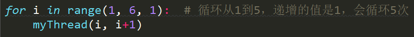
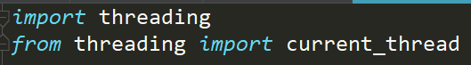

- Python中一个非常重要的概念，叫做**并发编程**
- 每次我们运行一个Python的程序，我们把这个程序运行的状态叫做进程
- 如果想要每一个进程里面像超市收银一样并发的去解决问题的话，我们需要在进程里面引入一个力度更小的概念，这个概念称作是线程

- 以上代码表示代码从1循环到5，递增的值是1，会循环5次

  

- 在编写代码时，如果这个方法比较长的话，推荐使用from...import...的这种形式
- 继承后面的类名都是没有括号的
- 用join()可以使主线程后结束