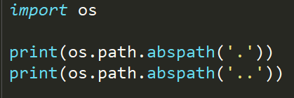
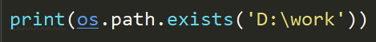
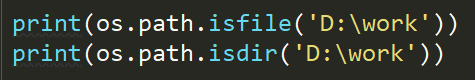
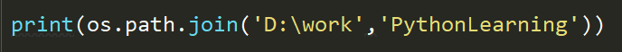
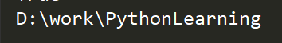
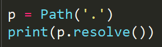

- 上述代码用来根据相对路径的'.'来获取当前文件的绝对路径

- 最下面的一段代码表示的是输出当前的上一级的目录

  

- 上述代码用于判断文件是否存在

  

- 上述代码用于判断文件是否是文件或者是目录（目录即是文件夹）

- 在编写我们的程序的时候，有时候我们会需要一个较长的路径，我们可能会去做路径的一个拼接

  

  

- os.path.join的后面可以跟着两个或者是多个需要连接的路径

- 上图为使用pathlib获取绝对路径的方式

- pathlib和os.path的大部分功能相同，但pathlib库有一个非常有用的功能就是去新建一个目录

  