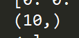

- NumPy库中的数据类型其实是非常非常多的，从int 8、int 16、int 32、int 64、float 32、float 64

- 这里的标量是指的我们物理当中标量的概念，只有大小而没有方向，比如温度、质量和体积

- 使用NumPy我们可以定义多维数组，二维数组其实也可以称作为矩阵

- NumPy提供了一些有用的方法可以是二维矩阵中的数据全为0或者是全为1

- 前面为行数，后面为列数；当只有一行是，则只会显示出列数，如下图所示

  

- NumPy中的数组下标也是从0开始计算的