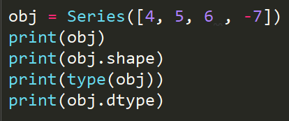
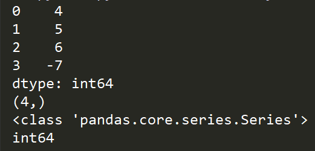

- Pandas是用来进行数据预处理和数据清洗非常重要的库
- Pandas库对比NumPy库的好处
  - Pandas会把数据自动或者按照你自定义的方式进行对齐显示，避免因为数据没有对齐而出现的失误
  - 使用Pandas可以很灵活的处理我们缺失的数据
  - 使用Pandas还可以实现类似于数据库中的SQL语句一样，进行相应的连接操作

- 可以使用Series进行一维数组的定义

- Series其实就是对NumPy中的array进行了一个封装，它的好处在于在前面自动添加了一个索引，使用索引可以更加方便的访问到相应的数据

  

  

- 在Pandas中，它的索引是可以重复的，这一点跟字典中的不一样，字典中的key是经过hash()运算的
- int 、float、string、tuple(元组)都可以作为字典当中的Key，因为字典当中的key是不可以重复，也不可以改变的；而列表和集合就不能够作为字典当中的key，因为列表和集合的内容是可以变化的