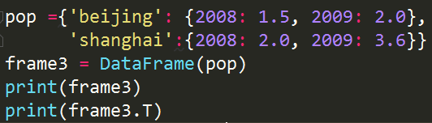

- Series在Pandas中相当于一维数组

- Dataframe更像是一个电子表格一样的格式，可以操作二维、三维甚至更高维的数组

- 在处理Dataframe的时候有点类似于对电子表格的一个处理

- 在Pandas中的DataFrame结构中可以直接使用如上图所示的'.T'对结果进行一个转置
- 在DataFrame中还有一个更主要的功能叫做reindex，叫做重新索引，就是说对我们当前的索引进行一个重新的修改

