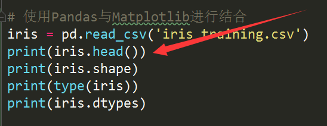

- 一般的我们在进行数据预处理和数据清洗完成之后，我们多数都会数据按照我们的横坐标、纵坐标进行一个绘图，利用人工先去检查一下数据的使用情况
- Matplotlib是用来绘图的一个主要的工具
- figure就是创建一个图表
- dpi 表示的是精度，精度就是你绘画的图形的详细的程度，精度越高，图片产生的体积就会越大，画的图片就会越清晰
- CSV格式一般是以逗号分隔开的各个字段

- 上面箭头标注的这一段代码是用来显示iris的前5行的数据
- 使用iris可以更加友好的绘制CSV文件
- seaborn是用来封装Matplotlilb的