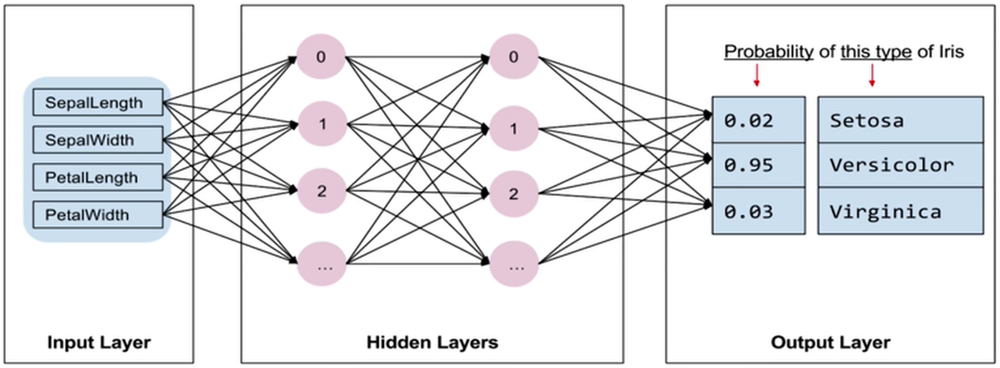

- 在实现机器学习、自动进行分类的过程中，不但需要大量的数据，还需要进行算法的设计，算法的设计对编程能力和数学能力都有很高的要求，所以如果是自己重新编写一个算法的话，会非常的困难
- Tensorflow是Python中非常著名的一个库

- 第一个方块为输入层，输入层用来输入train_x要训练的4个特征
- 中间的方块称之为隐藏层
- 接下来要把训练的数据依次传入隐藏层中的每一个节点， 然后根据我们的不同特征， Tensorflow会自动计算这4个特征应该要走哪一个路径，最后会来到最外面的方块，称之为输出层
- 第3个方块叫做输出层
- 在最开始的时候我们提供了训练数据，也是提供了输入层和输出层的结果，我们是在通过输入层和输出层的结果大量训练隐藏层的节点
- 使用Tensorflow不用去设计模型里面具体的数学和编程的内容

