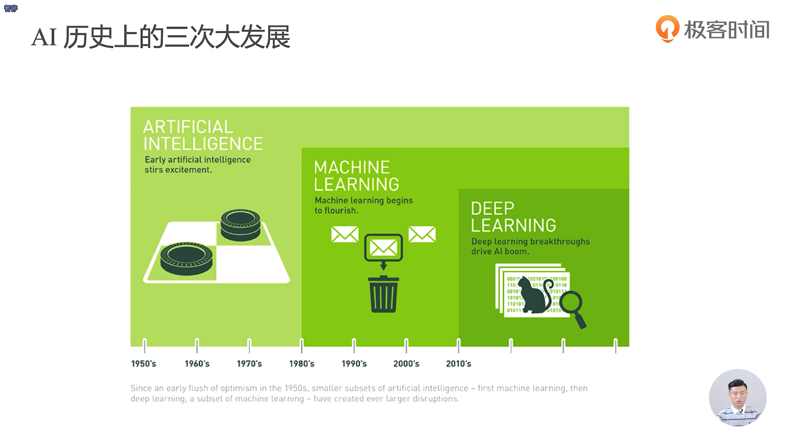
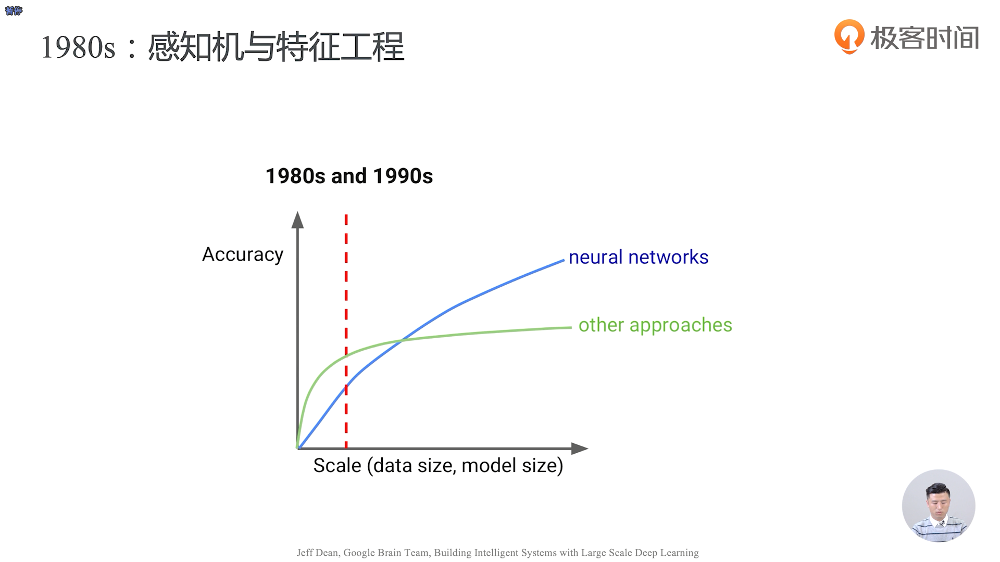
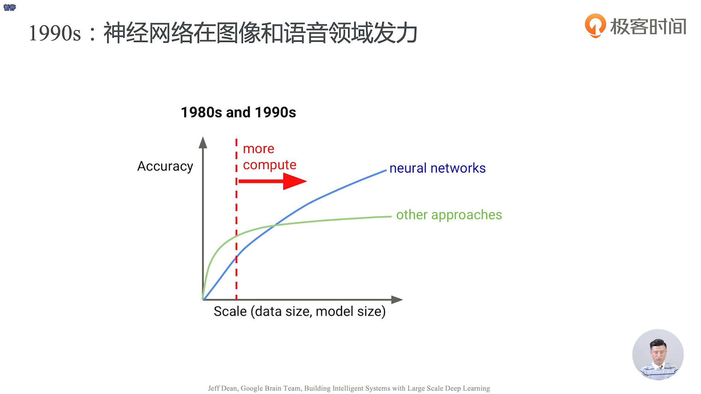
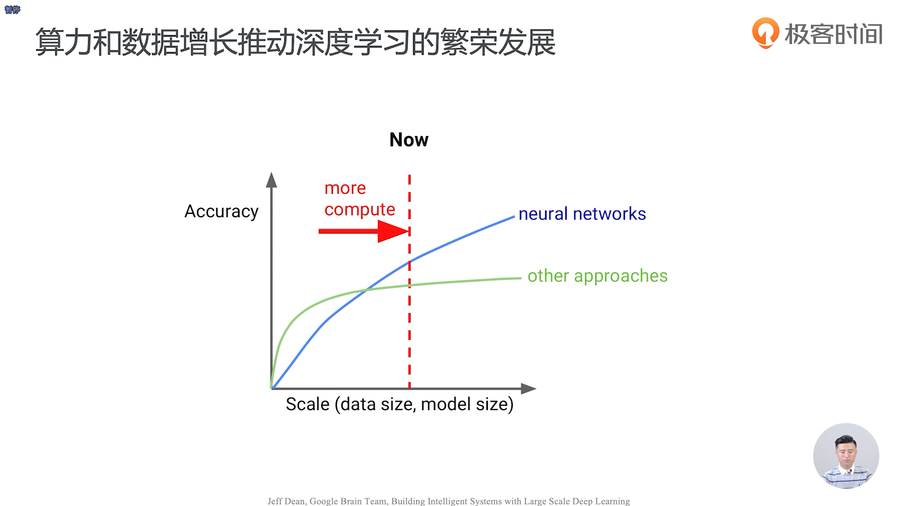
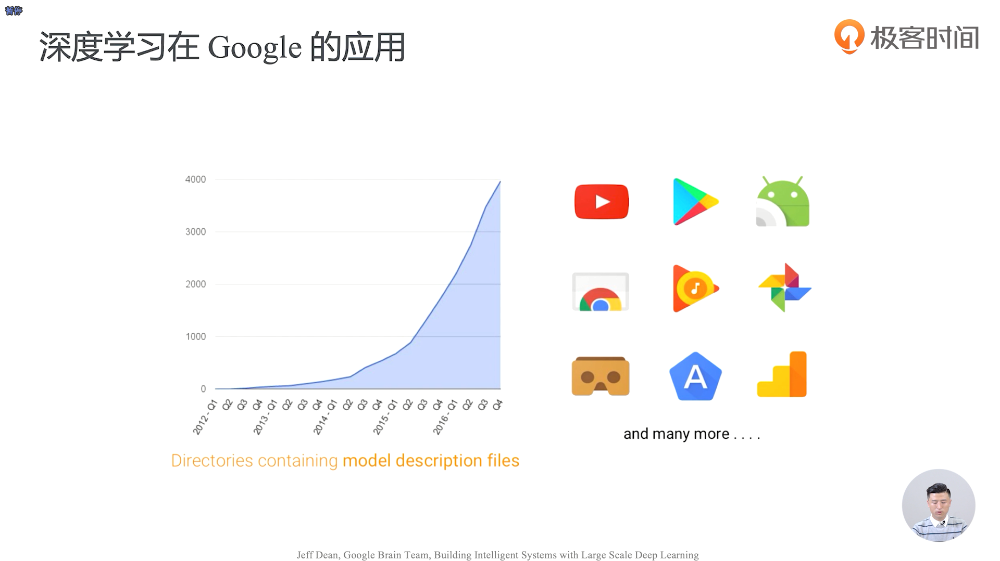

- 人工智能 -> 机器学习 -> 深度学习

- 两到三层的神经网络也被称作多层感知机
- 如下图所示，从1980年代，我们的非神经网络算法其实是具有更高的准确率的，这其中的原因一部分是因为我们的数据量不够多，另一方面也是因为我们的模型大小是比较小的，那会我们的神经网络可能就是一个两到三层的一个神经网络，这个时候的神经网络也被称作是多层感知机

- MNIST就是机器学习界的 Hello World

- 反向传播技术、梯度下降法

- 自动加字幕、个性化推荐算法、人脸识别 
- 