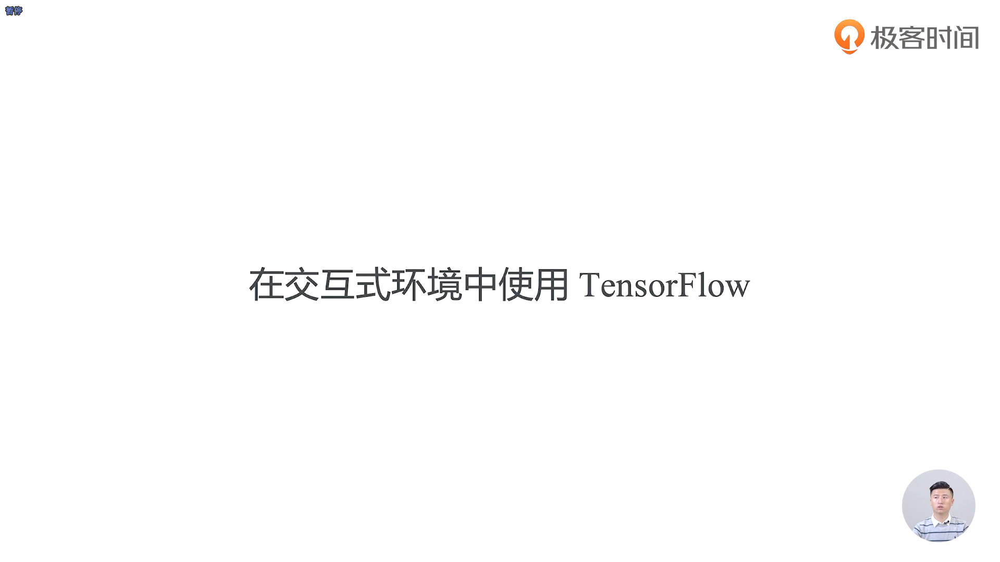

- 在神经网络里面，从比较浅的力度可以分为3类，第一层为Input layer，也就是输入层，我们的训练数据大部分都是通过输入层去输入，第二层为hidden layer，也就是隐藏层，即全连接层去描述函数，第三层为output layer，即输出层，此输出层是输出的一个函数的预测值
- 估量预测值和真实值之间一些差距的算法和函数，我们通常称之为损失函数
- 在一些经典的神经网络学习过程中，我们每一轮的学习率其实是会变的
- softmax_cross_entropy表示是采用的交叉熵的方式来算损失函数

