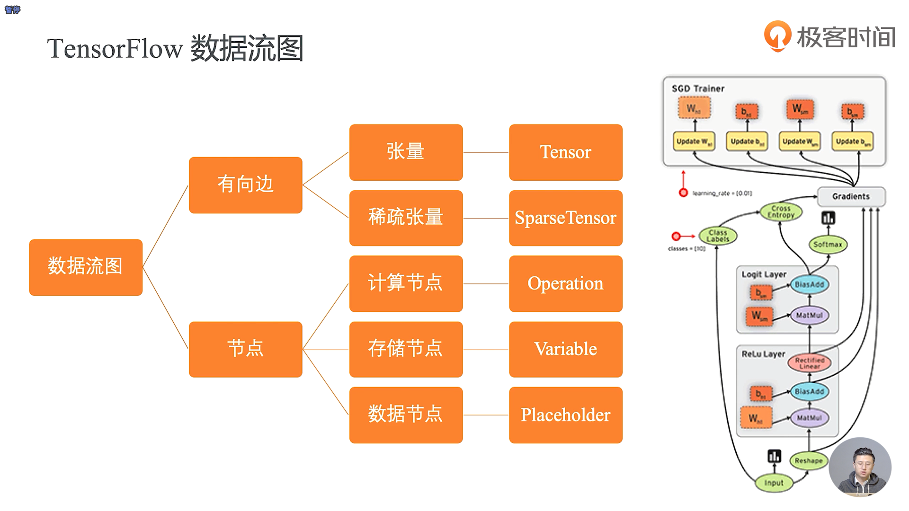
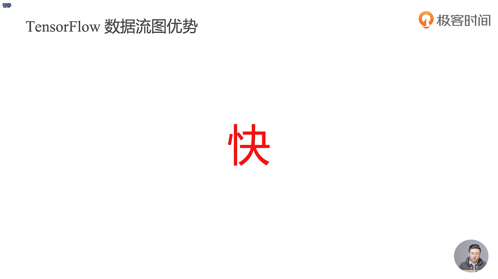
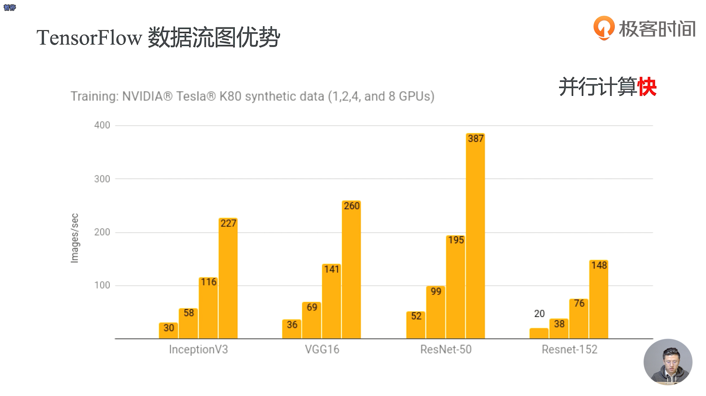
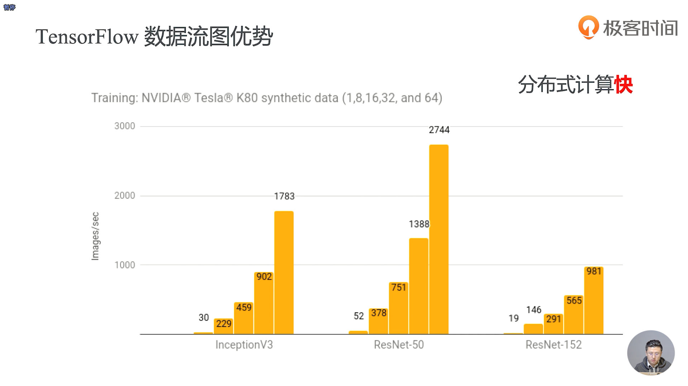
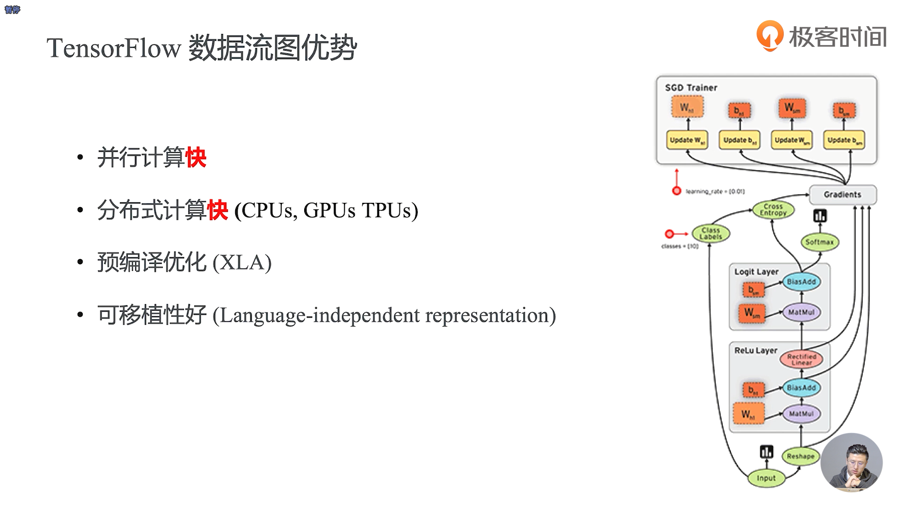
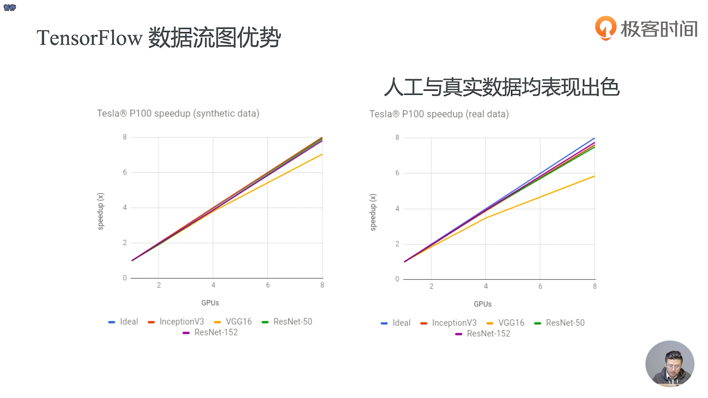

- 声明式的编程更加适合于一些结构化、抽象化的方法

- 图里面有2个相当重要的元素，一个叫边、一个叫点
- 张量其实可以简单的理解为数据
- Relu Layer 是一个激活层， Logit Layer 是一个全连接层
- 我们在神经网络中用到的数据其实是一个非常高的维度，张量就是可以很好的表示这种高维数据的一种抽象，它使用了多维数组的这种表达方式去表达数据
- 稀疏张量就是把张量中有意义的值才存下来
- 计算节点就是用来计算的一些操作
- W 和 b 就是我们神经网络用来训练的对象， W 是权重，b 是偏置
- Placeholder用来描述我们图外输入的数据，它会去描述这个数据的类型，这个数据的形状

 

 

- 数据流图在并行计算上面很快，因为我们采用了可执行队列和拓扑排序的思想

