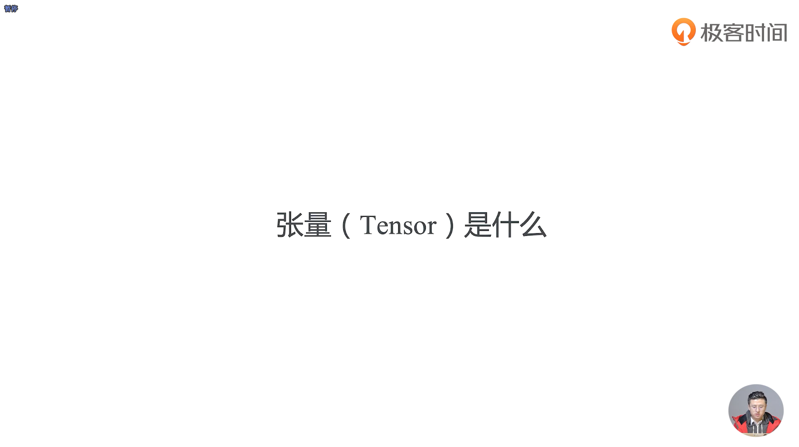
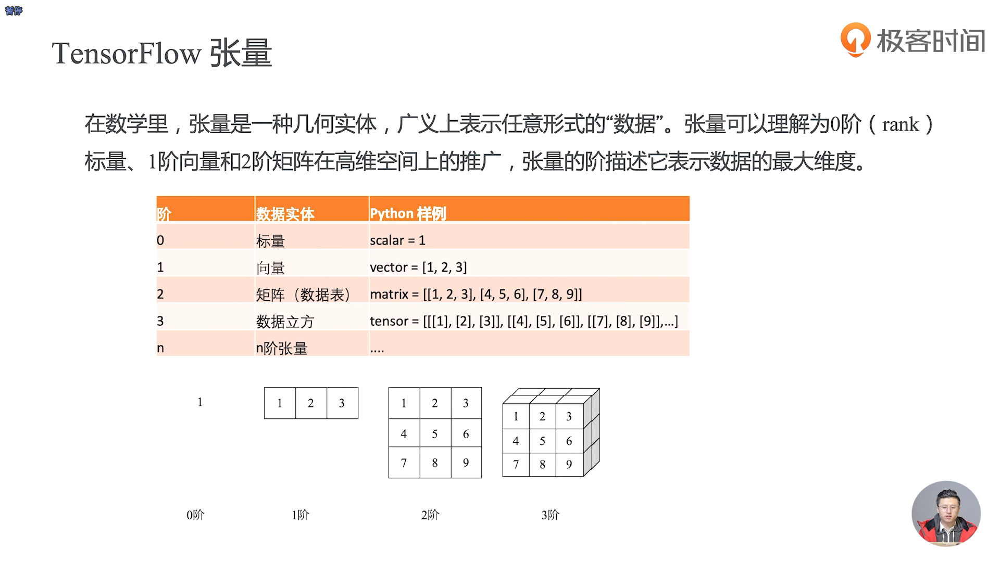
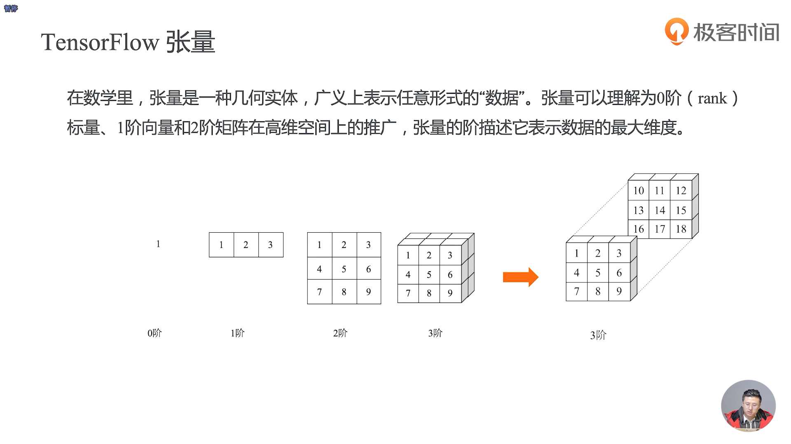
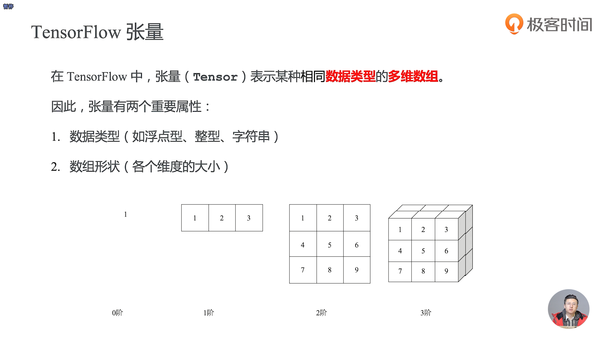
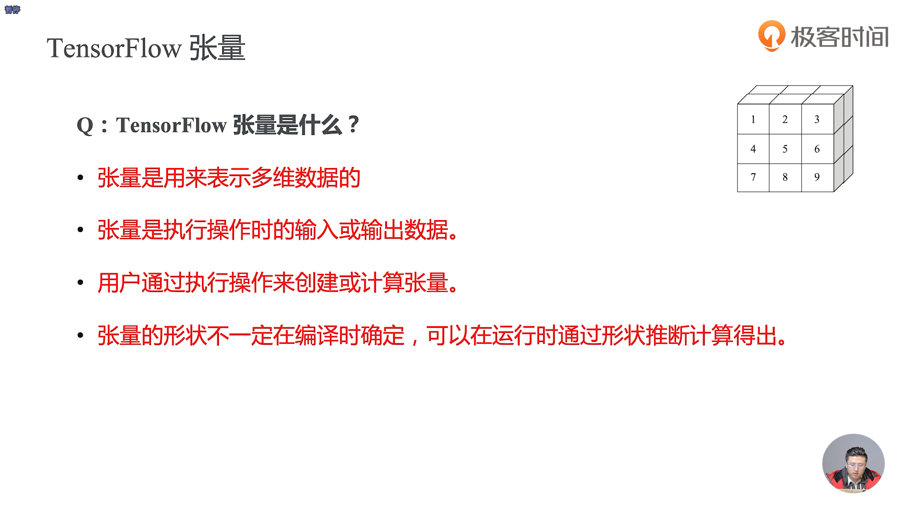
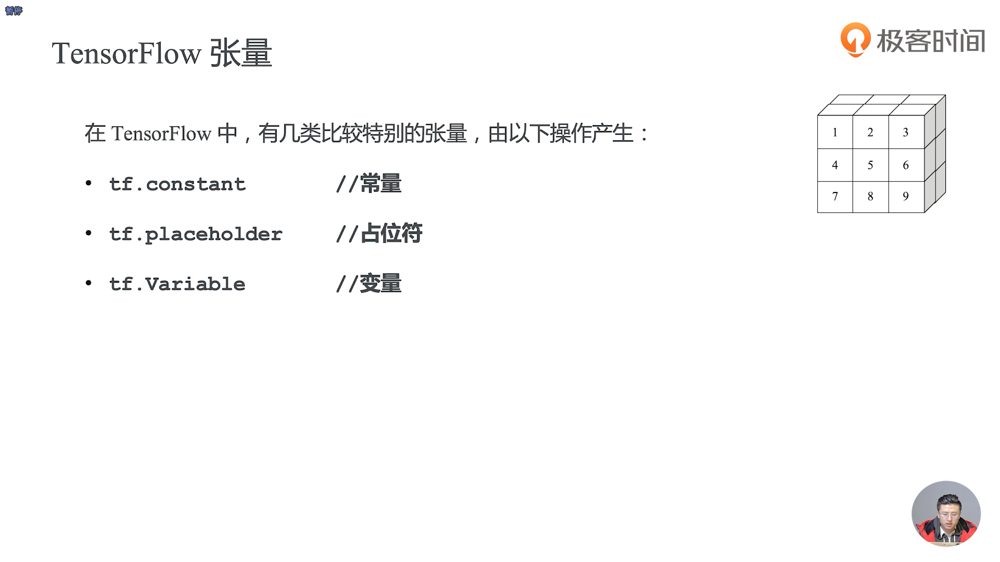

- 张量的阶其实是表示它最多有多少个维度

- 在一个特定的操作的执行过程中，张量一定是不可改变的
- placeholder是占位符，可以简单的理解为描述的数据的一个壳

- TensorFlow的张量是用来表示数据的，甚至可以表示任意维很高维的数据
- 常量产生的张量是永远都不可以改变的
- 占位符产生的其实是高维数据的一个壳，需要从图外填充数据，在运行的时候才能确定的张量
- 变量可以在整个数据流图运行过程中维护变量的状态，使得这个值在整个运行过程结束后也不会被释放，它会一直常驻在内存里面，使得我们的值可以保存下来