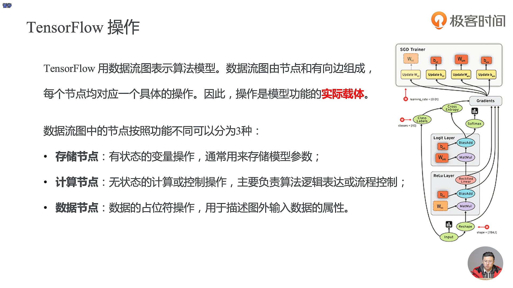
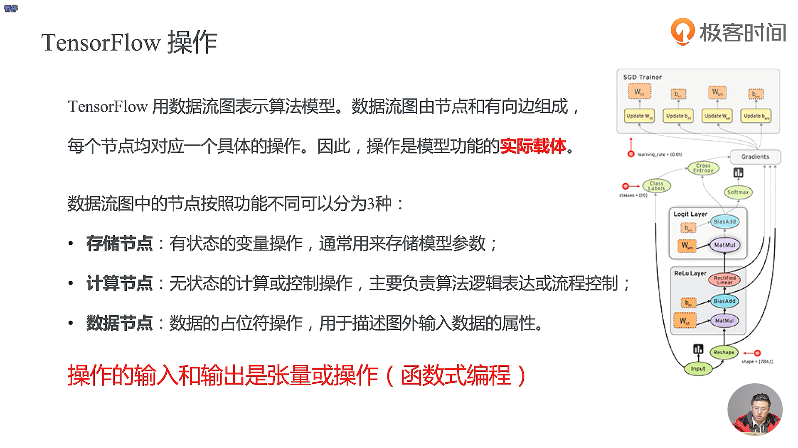
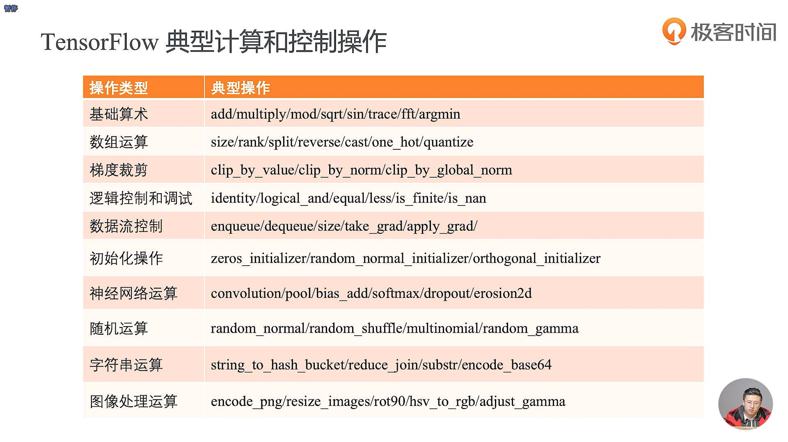
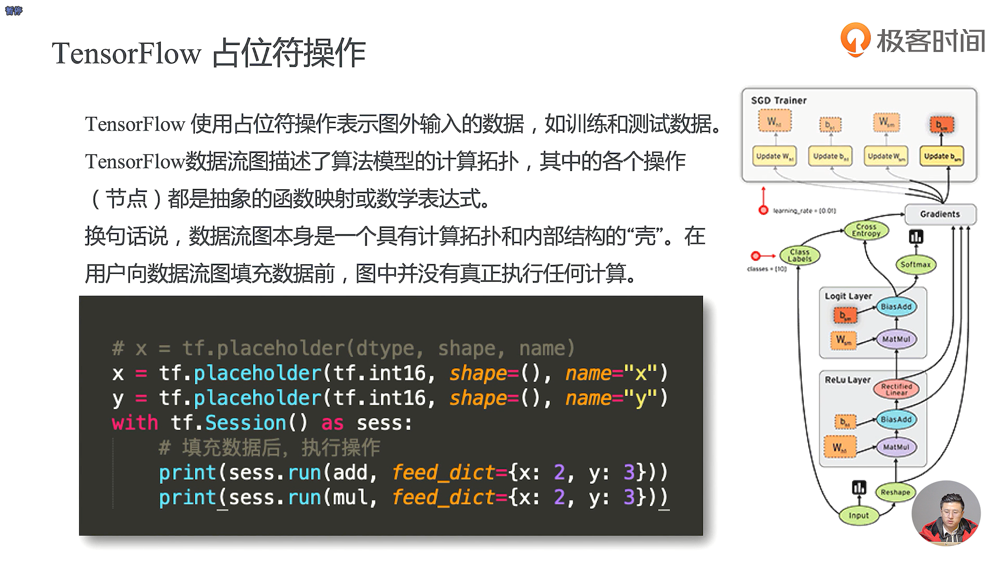

- 数据流图是一种声明式的编程范式

- 有的时候一个操作的结果又可以作为下一个操作的输入，有的时候一个操作的表达又可以作为下一个操作的输入

  

- 基础算术的操作主要是对一些标量的操作
- 后向的传播过程中间我们需要对梯度进行一些操作
- 并不太推荐使用 TensorFlow 中的关于逻辑控制的操作
- 我们在做图像处理的时候可能会需要把一些RGB图片转化为一些灰度图

- 要从数据流图里面取数据需要用到sess.run()这个方法
- 要往数据流图里面填充数据的话需要通过占位符去往里面填充
- 当我们定义好两个常量的时候，这两个常量的值并没有真正的执行，只有在会话里面去执行它们的时候它们才真正的填充上了值
- 常量的本身是不需要填充数据的
- 在这里我们的 add 其实只是定义了一个加法操作本身
