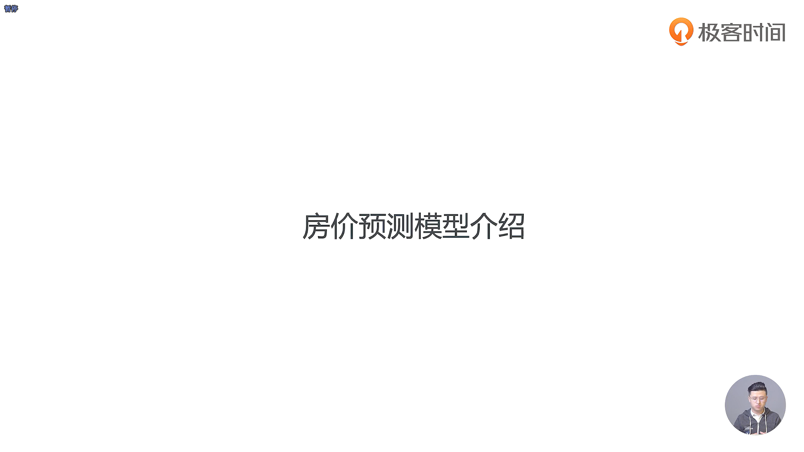

- 房价预测模型我们一般是使用线性回归这种算法进行拟合，线性回归又是属于我们机器学习中的监督学习的这种方法

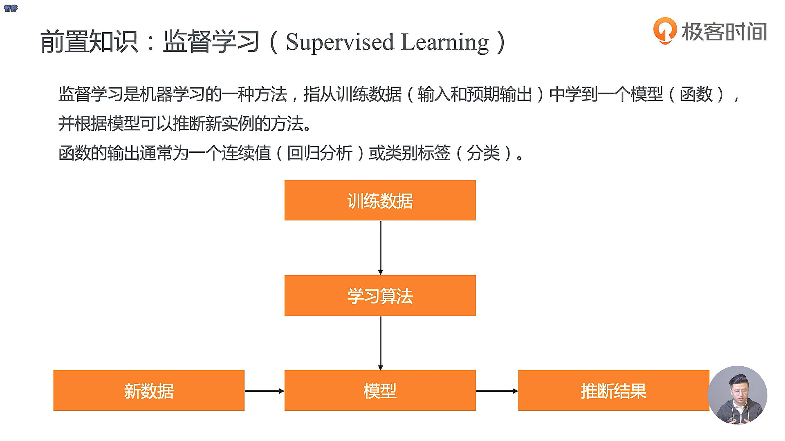

- Alpha Zero 是一种无监督学习算法的结果

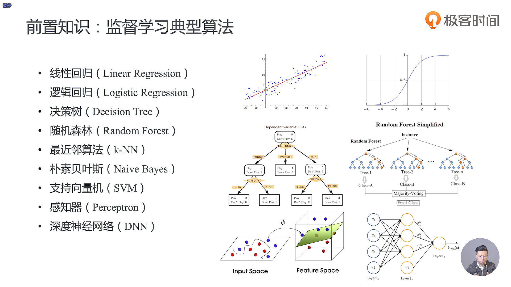

- 随机森林的 Base Estimator 就是决策树，随机森林下面会有很多个决策树
- 深度学习一个成功的前提是你的数据量真的是足够的多，能够去喂饱你的模型
- 深度学习中大量的参数并不需要人为的去设计，而是直接基于数据去训练，这样你就可以得到想要的函数或者是模型

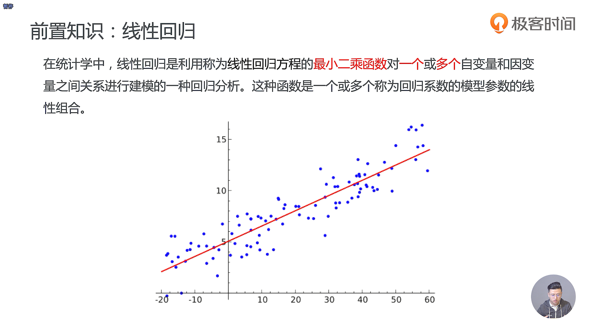

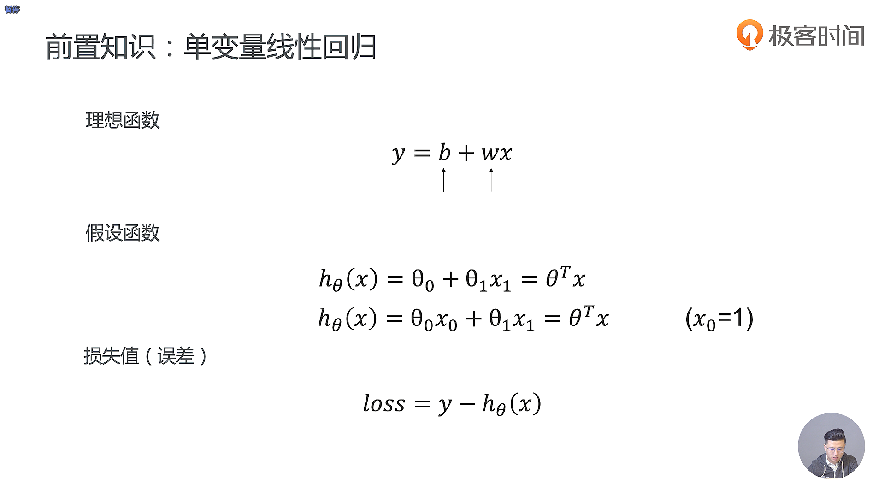

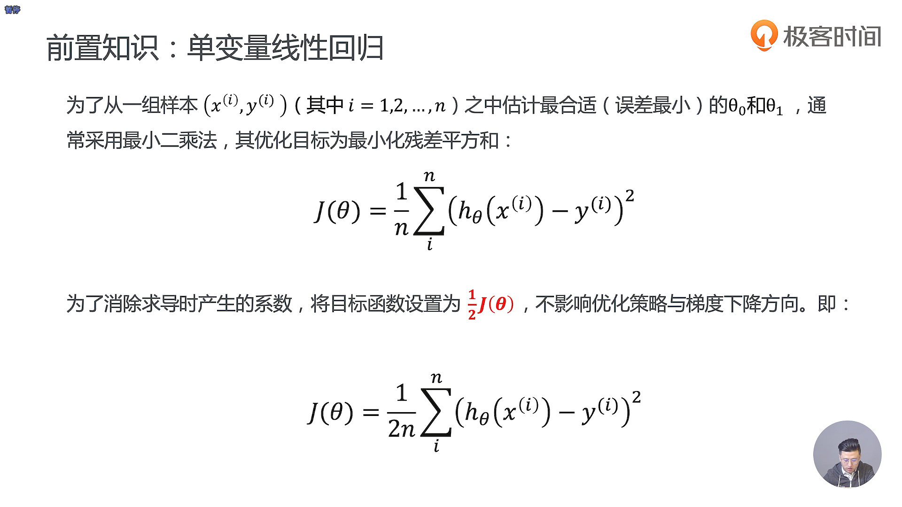

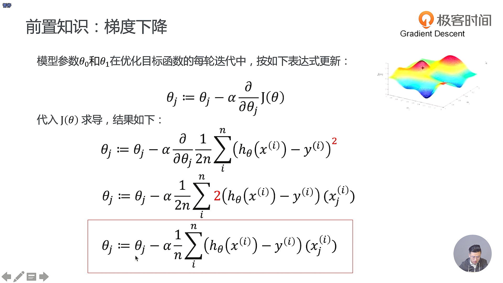

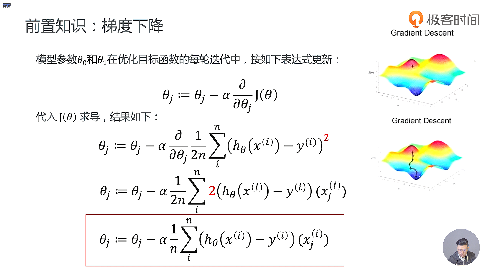

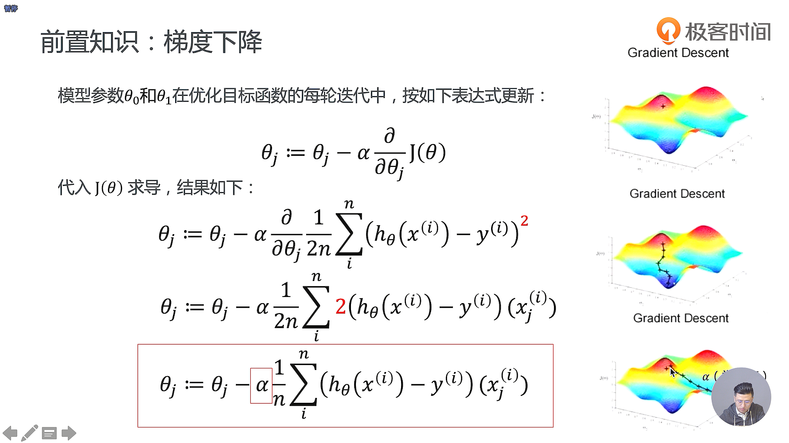

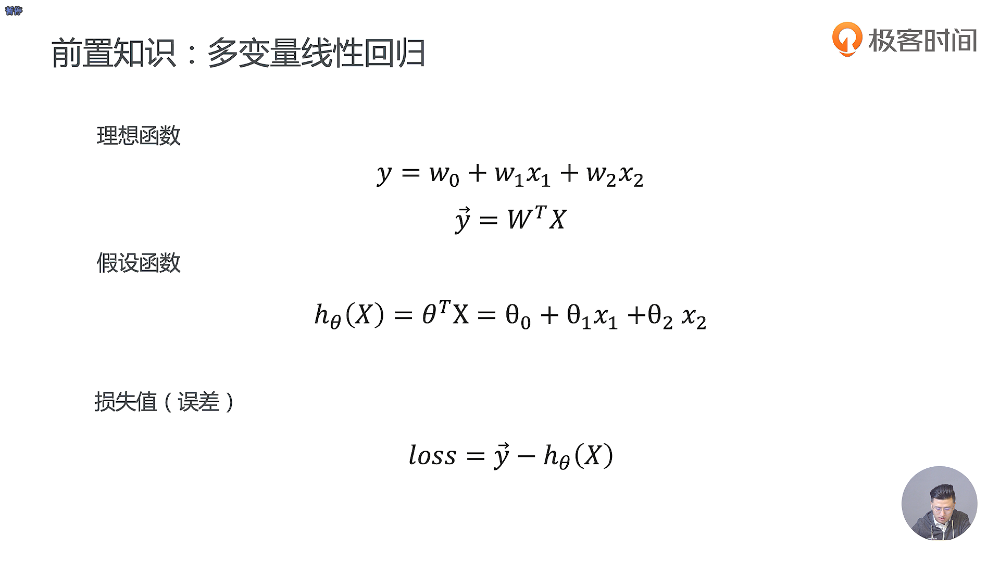

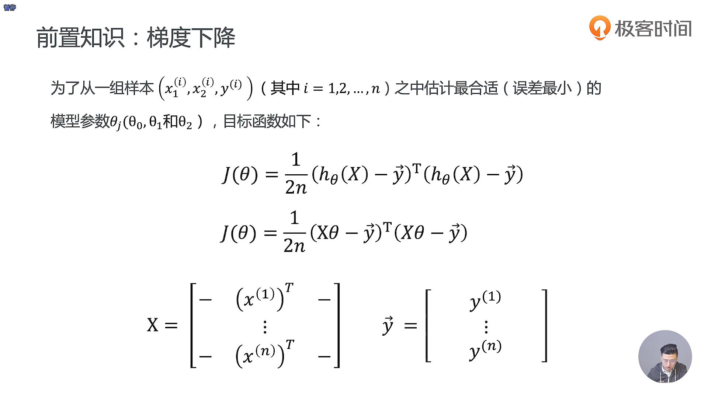

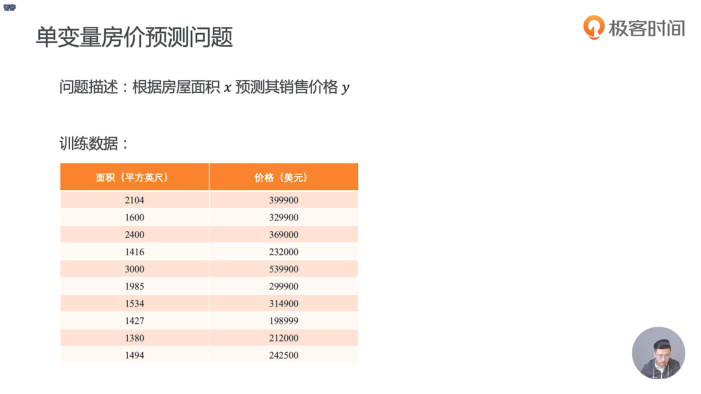

