- 神经有突触，它会传递信息，就是会有一个阈值，当信息大于这个阈值时，突触会把这个信息由一个神经元传递到另外一个神经元，当没有大于这个阈值时，是不会传递这个电信号的
- 非线性的激活函数

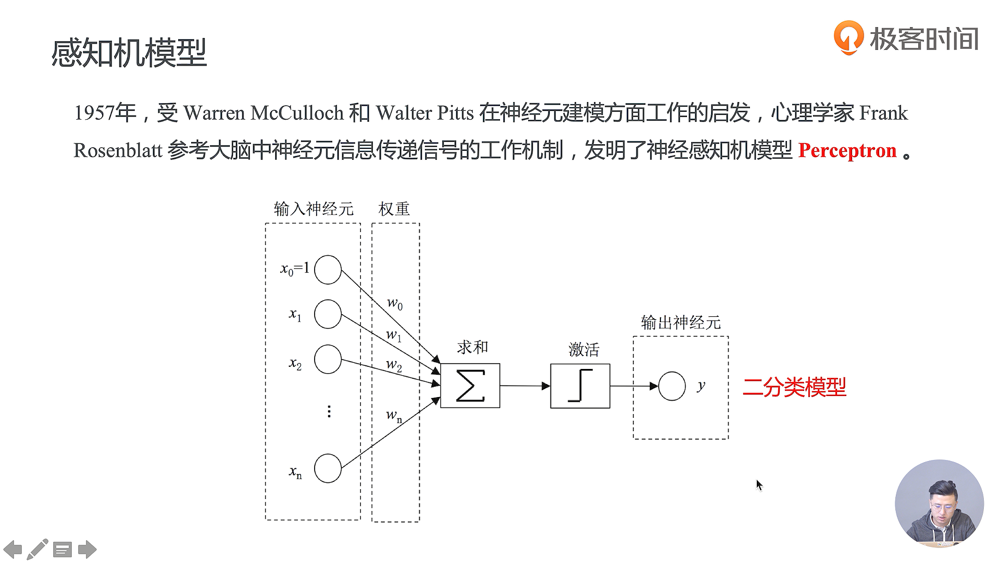

- 当求和的结果大于这个阈值，我们就输出1，当这个值小于这个阈值时，我们就输出0
- 有可能实际的函数是一个非常复杂的函数，你是写不出它的表达式的，但是你有输入数据跟标签，这个时候就可以把它丢进神经网络里面，接下来神经网络会拟合出一个复杂的函数

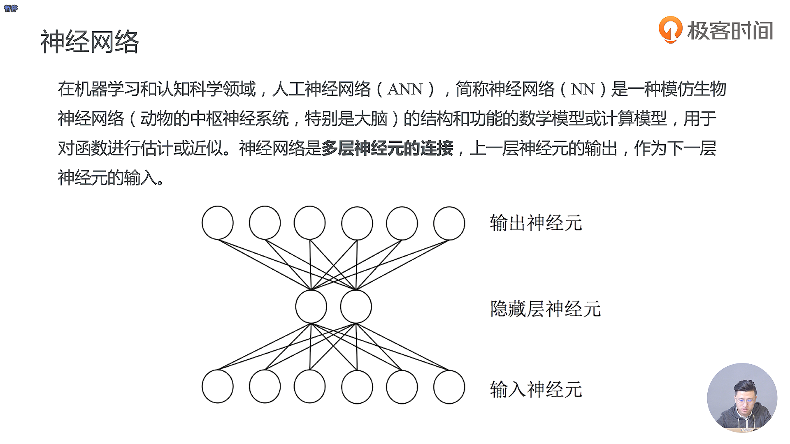

 

- 感知机的局限就在于我们通常是作为一个二分类的模型

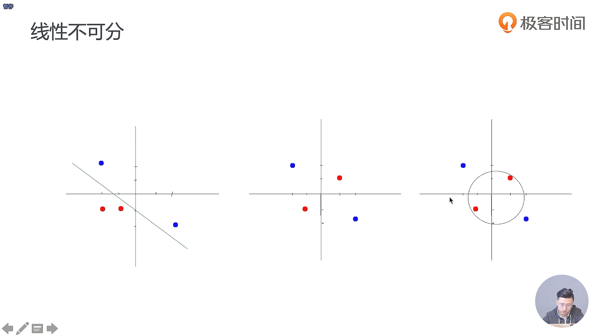

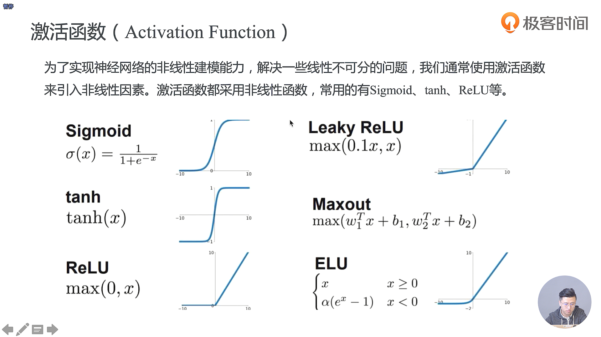

- 现在比较常见的是 Sigmoid 和 ReLU 用的比较多

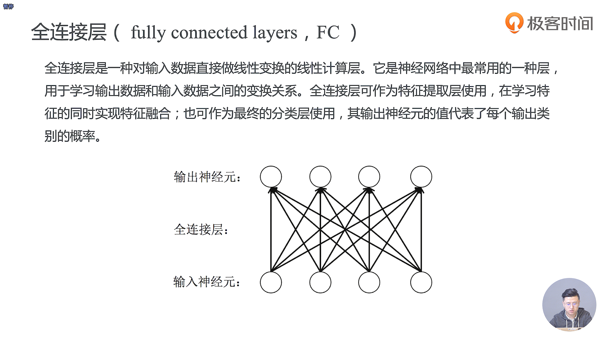

  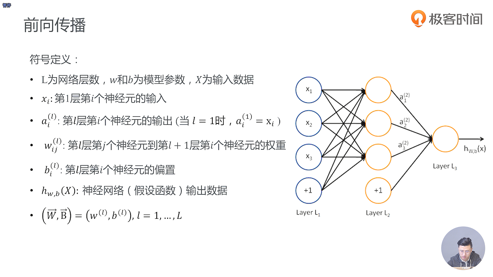

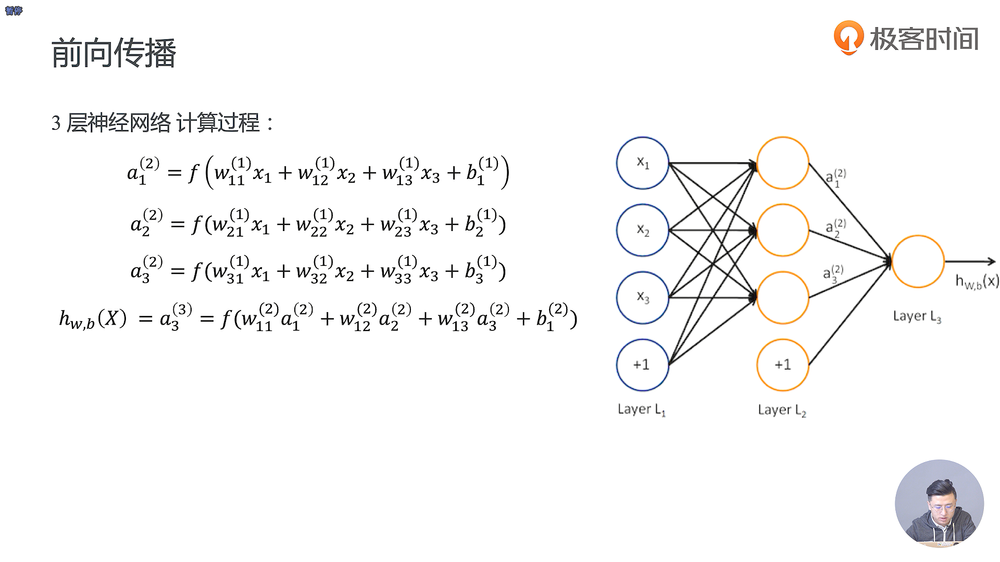

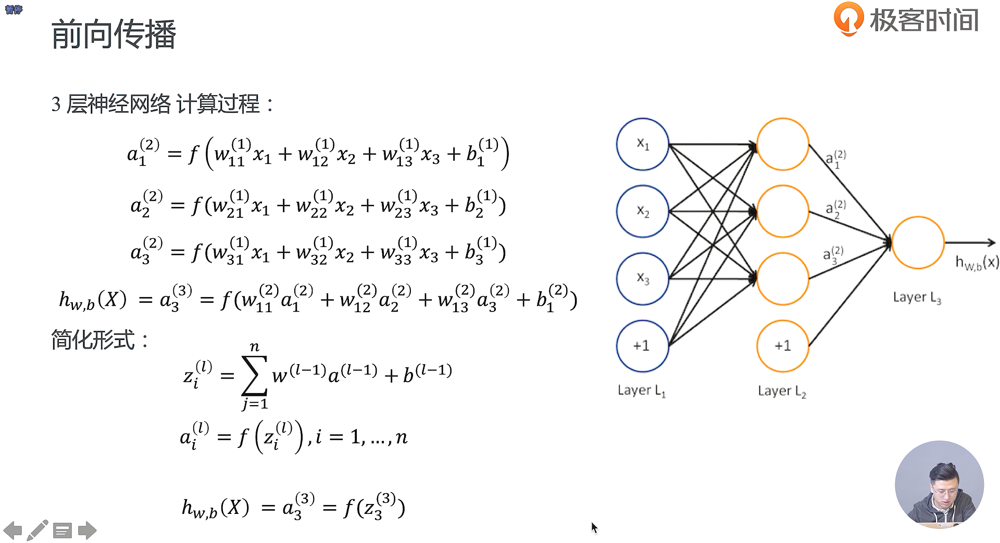

- 后向传播是我们梯度下降里面需要用到的很重要的一个概念

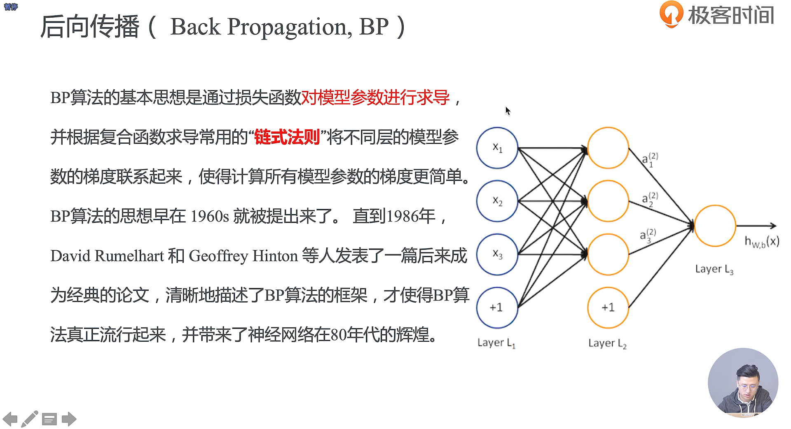

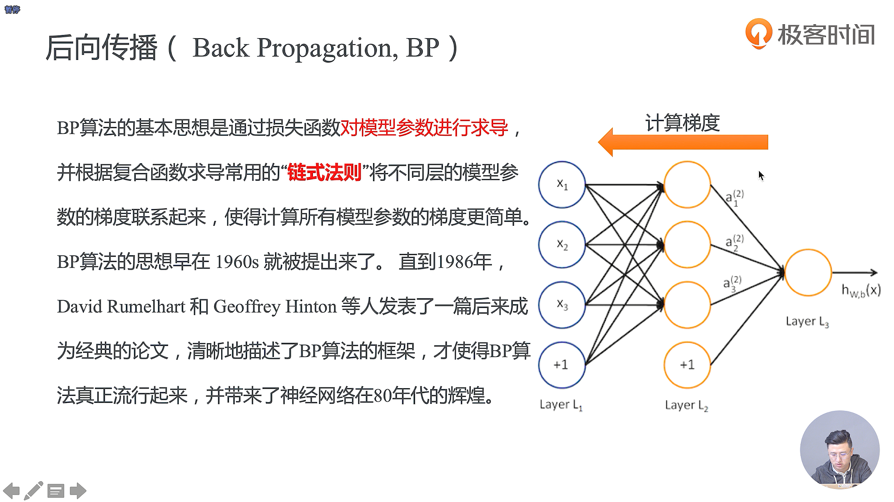

 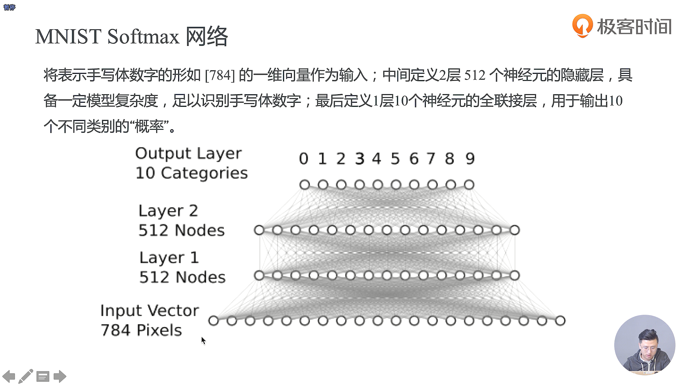

- 中间定义两层隐藏层，用来学习输入数据和输出数据之间的关系，在每一层之间都有对应的激活函数，去做对应的非线性的激活