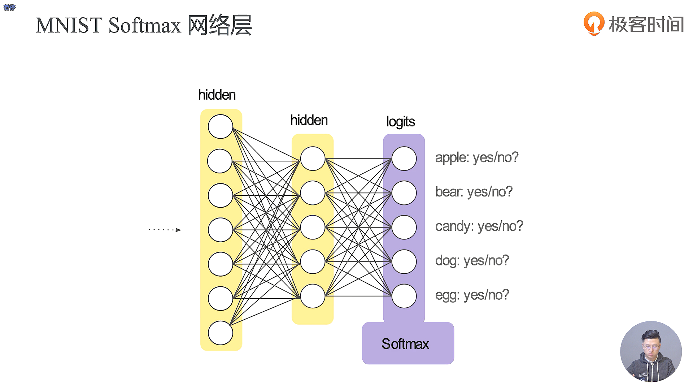
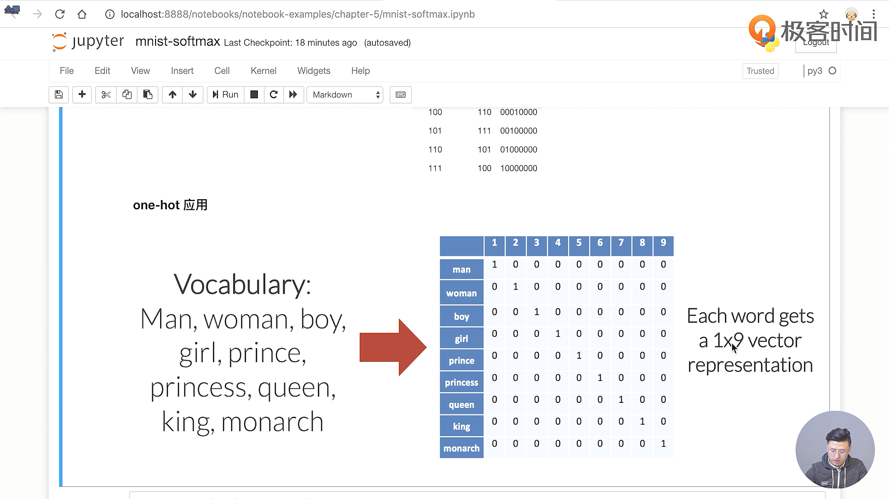

- 感知机只能进行一个二分类的处理，而不能进行一个多分类的处理

- Keras 本身是支持很多的引擎，其中TensorFlow是它的默认支持的引擎 
- 各个类别的标签的数量是均匀的，这就避免了有的标签过少，可能导致欠拟合，而有的标签过多，可能导致过拟合
- 数据的处理方式中的有一种叫做 one-hot 编码
- one-cold 编码其实就是 one-hot 编码的翻过来的形式

- one-hot 编码的好处就是可以和我们最后的 Softmax 的输出概率相对应起来
- 在 Softmax，在手写体识别这个领域，使用 one-hot 编码可以方便我们进行损失值的计算
- 在训练神经网络语言模型时，一个相当经典的算法就是使用我们的 Word2Vec，是一种把单词做成词向量的算法，核心思想就是使用尽量小的向量去存储所有的词汇
- batch_size指的是我们每一轮丢进去的数据大小，我们的每一步训练其实就是一个batch_size
- epochs 表示我们在模型的训练过程中一共需要遍历多少次我们的数据

