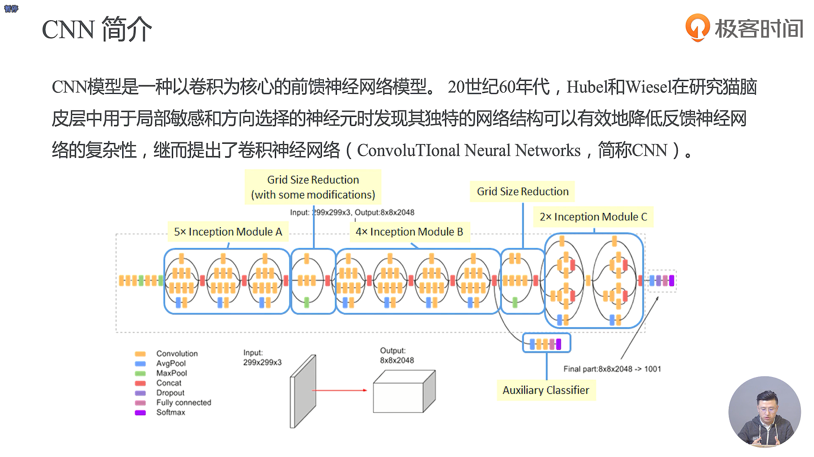
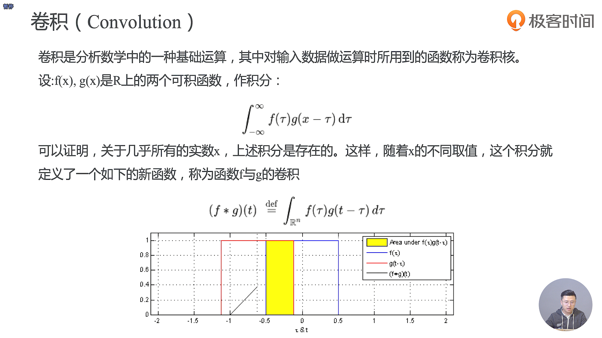
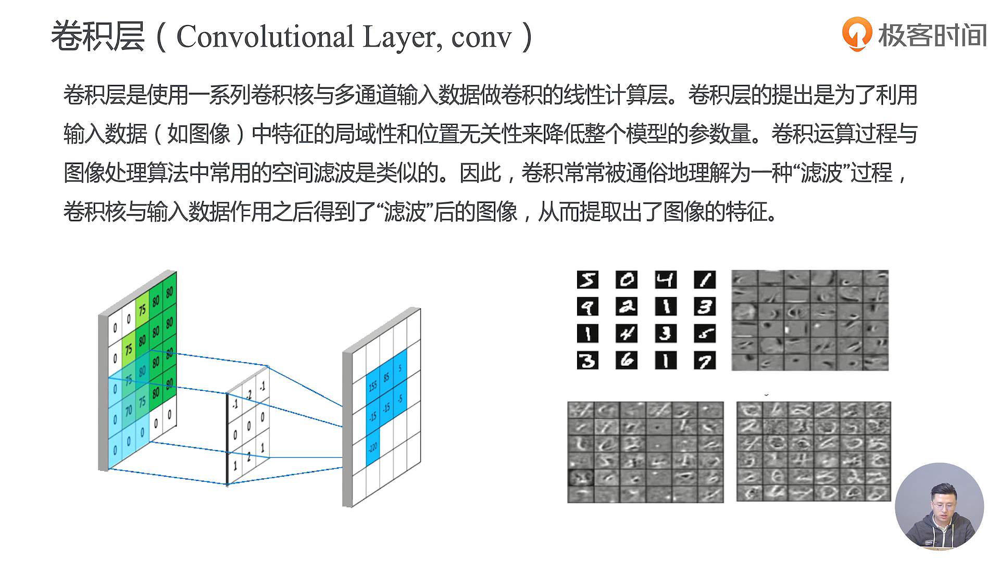
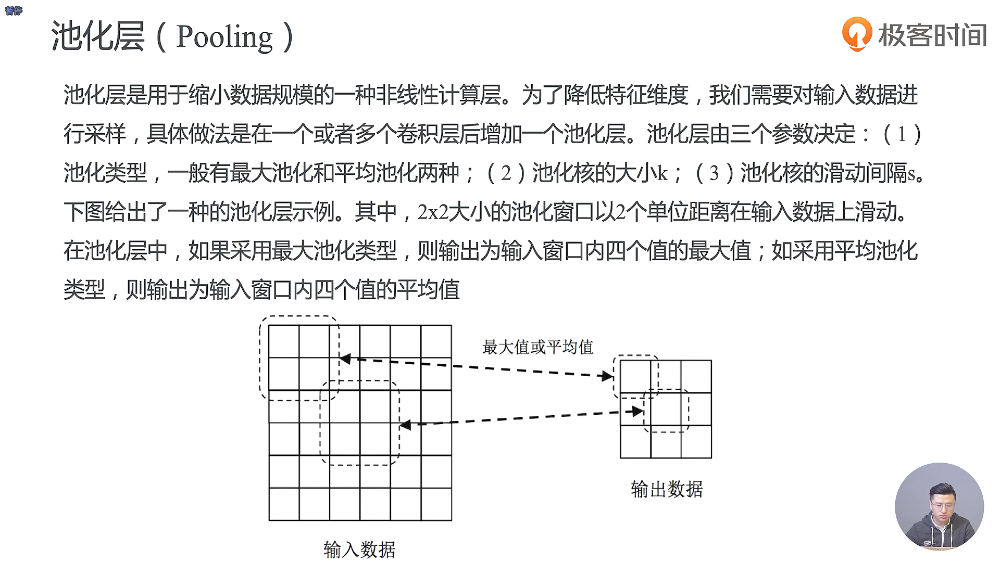
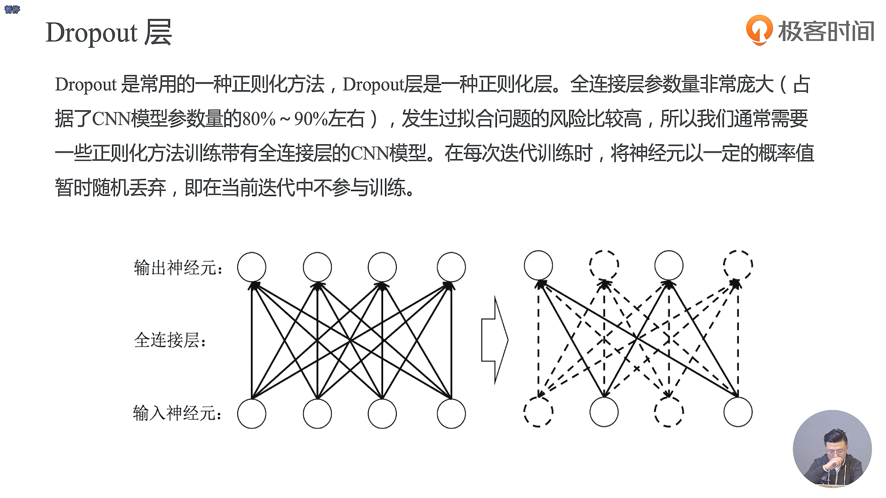

- Convolution表示的是卷积，AvgPool是平均池化，MaxPool表示的是最大池化，Dropout是用来解决它过拟合的问题，Fully Connected表示的是全连接，Softmax表示的是Softmax网络，用作多分类器，Concat表示的是连接的意思

- 卷积核与输入数据作用之后得到的”滤波“后的图像就称作feature map

- Dropout 是一种常用的正则化方法，Dropout层也叫作正则化层
- 在每次迭代训练过程中，我们不希望所有的神经元都是被激活的，通过Dropout可以有效的降低我们模型的复杂度，这样我们每一次训练的模型都是由不同的神经元组成的，实际上就是由不同的模型参数组成的，神经元的这种随机组合就减少了我们神经元之间可能形成的共同依赖，Dropout就使得我们最终训练的神经网络是由多个Dropout之后的子模型组成的。我们在预测的时候是需要所有的神经元参与的，这就很像一个 join 的 model，类似于随机森林的概念

-  MNIST CNN首先是将原图进行特征提取，然后做了池化，就得到了 Pooled Feature Map
- 输入经过卷积之后可以得到 Feature Map，再经过池化，Feture Map就会变小，再经过卷积去提取它的特征，再经过池化提取关键的一些特征，然后输入到全连接的网络，经过全连接的网络学习之后我们得到一个高维的函数，这个高维的函数经过我们的Softmax就会形成10个我们的分类器。最后这个分类器会在输出层输出10个概率
- 整个MNIST CNN 和 MNIST Softmax 的区别就在于MNIST CNN 多了一个feature extraction（提取） 的过程，