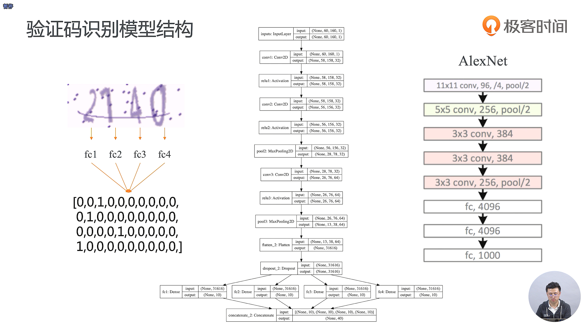

- AlexNet 这种网络其实有几个很重要的贡献
  - 第一个是它通过了几个卷积和几个池化的方式去提取了特征，激活函数从 tan 改为了 relu
  - relu 的激活空间是不受限的，收敛速度会更快
  - 在全连接层使用了 Dropout，可以有效的防止模型的过拟合
  - 使用了 BatchNormalization，对于同一批的数据可以去做规范化，提高它的泛化能力，防止它过拟合
  - 经过了卷积和 MaxPooling 之后做了更多的关于卷积和的操作

- 卷积层其实是相当于一个黑盒子，其实是很难理解它到底做了什么，也很难逐一的去解释它的每一个操作到底代表了什么样的意义
- 大家做的比较多的一个事情就是去可视化卷积操作
- 现在能够得到的一些比较明确的一些经验是卷积操作可以进行特征提取
- 卷积层次越深，其实学习到的特征的维度也就越高

- 通过卷积，我们能够进行一些高维度的特征提取，并且我们不再需要人为的去手工的去设置一些滤波器，而是可以通过大量的数据去训练，因为同样标签类型的数据是有一些共同的特点的

- VGG-16相对于AlexNet来说，卷积层数更深，后面又接了一个大的全连接网络
- 在深度神经网络出来之前，有一个很热门的领域叫做特征工程，主要就是指的怎么样把你的原始数据的特征给提取出来
- 特征工程做的好的话，你的分类的分类器其实并不需要特别复杂
- 全连接层不用，全部使用卷积层，我们也同样可以做好这个分类任务

