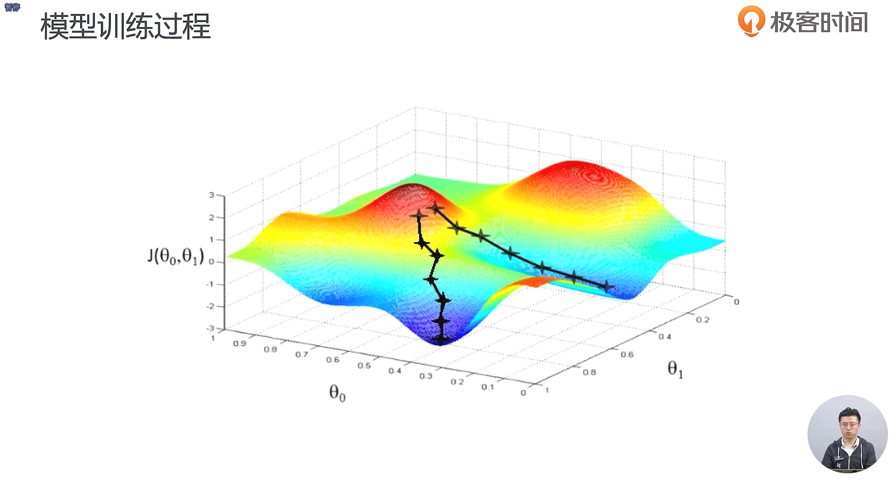
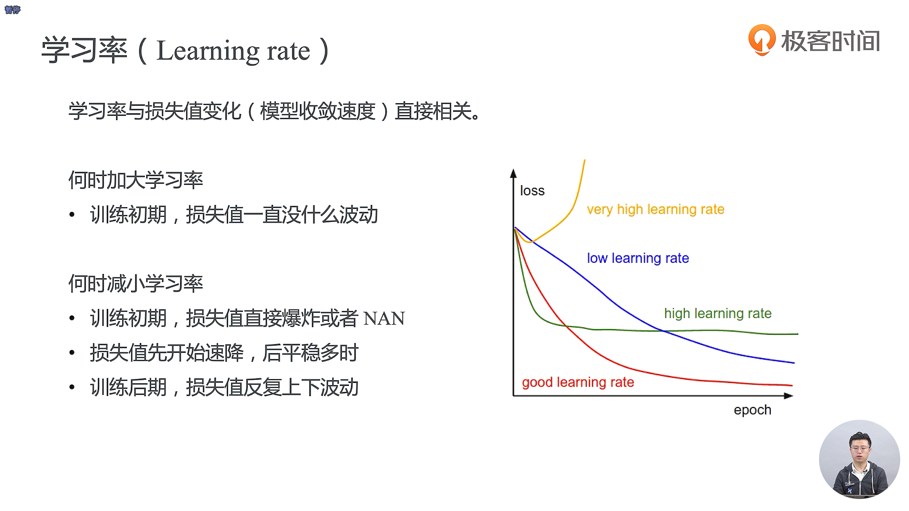
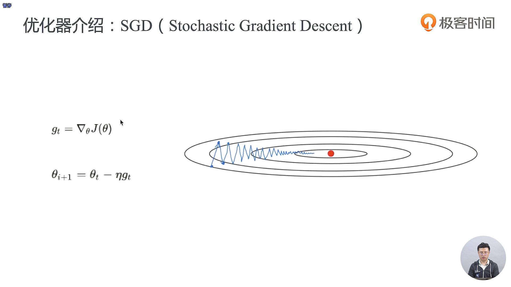
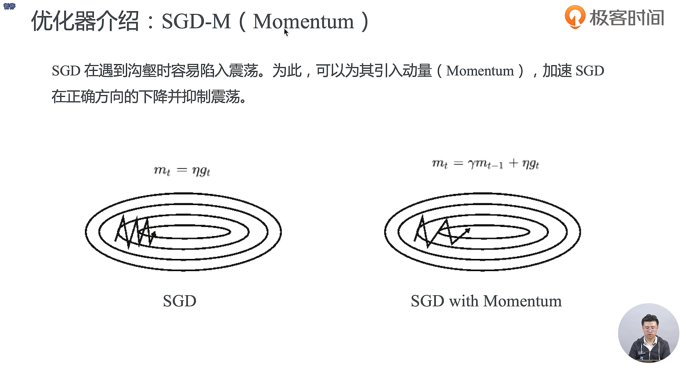
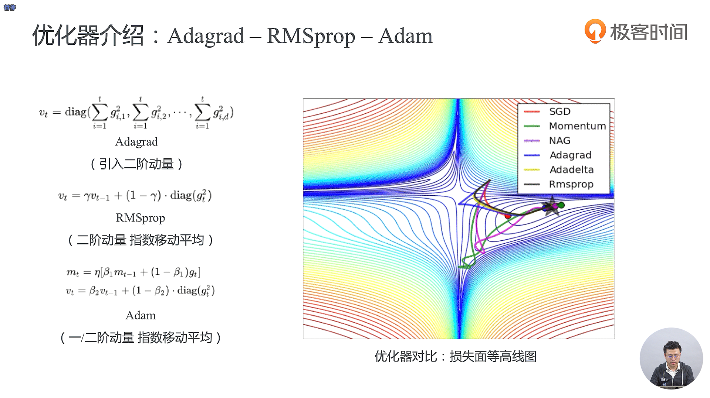
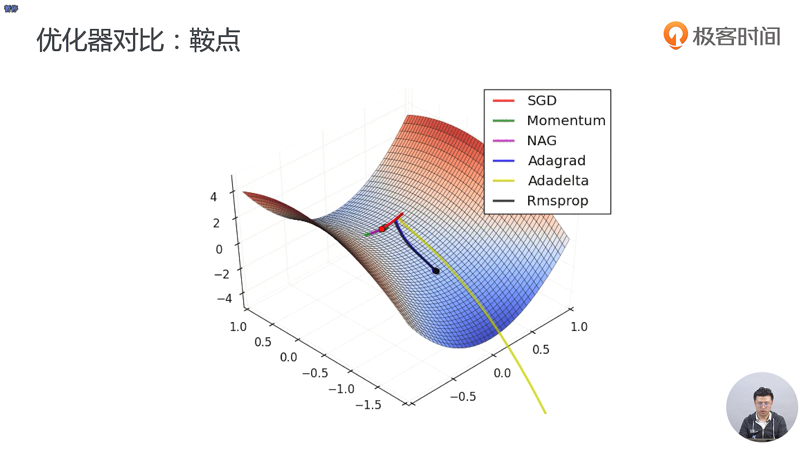
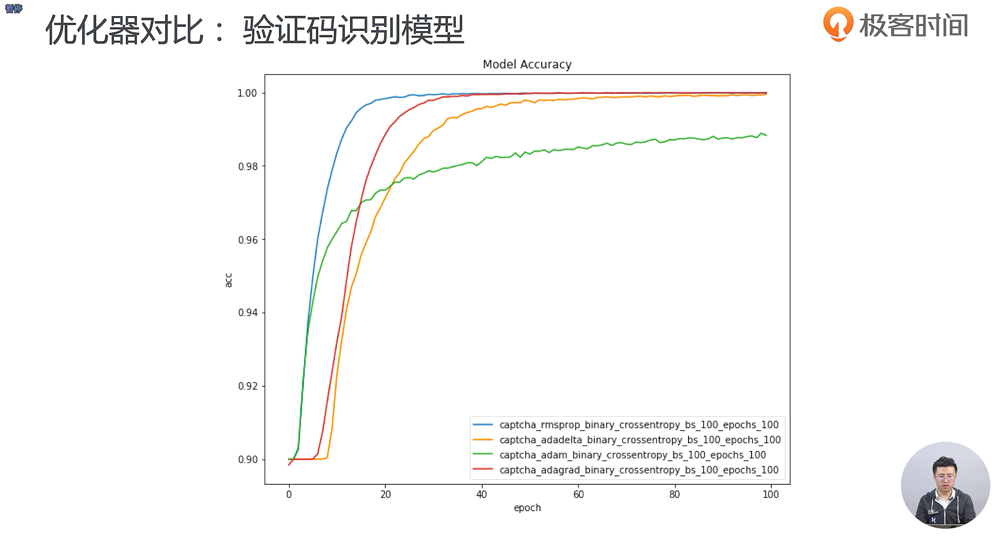
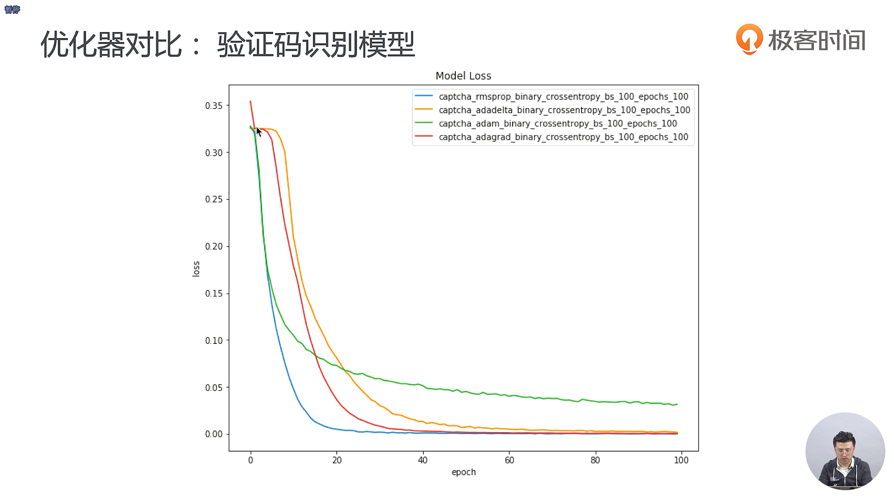

- 是采用的梯度下降的方法进行优化的

- 上面右图中的γ是一个经验值，我们通常取 0.9 作为它的初始值

- 在深度学习模型中，有的参数可能更新的特别频繁，有的参数可能更新的不是那么频繁，鉴于这种情况，我们就希望更新的比较频繁的参数单次的步长小一点，使它学习到的参数更加稳定，而不至于被单个样本影响太多；而更新的不那么频繁的参数，我们希望它单次的步长更大一点，多学习一些知识
- 自适应主要是为了减小大家在调参经验上的不足而可能导致的一些问题

- 在训练集上面的准确率表现得非常高并不一定就是一个非常好的状态，因为存在着对训练集过拟合的现象，此外还需要看你的 Loss 值，尤其是测试集上面的 Loss 值

- 为了防止过拟合，我们需要同样注意测试集上面的一些指标