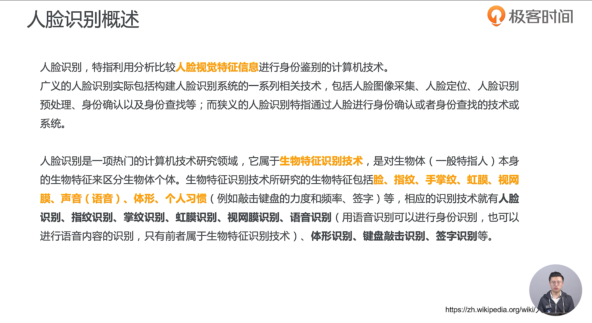
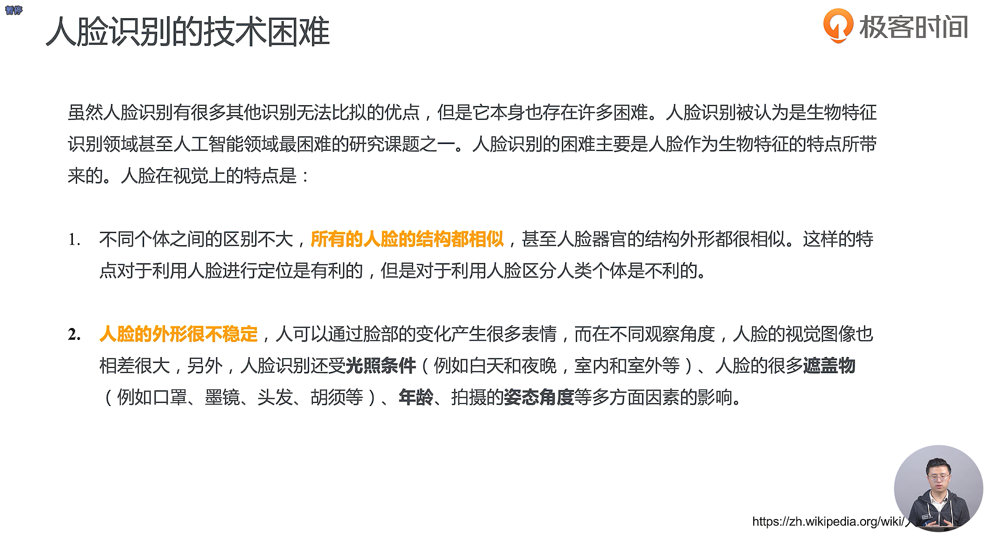
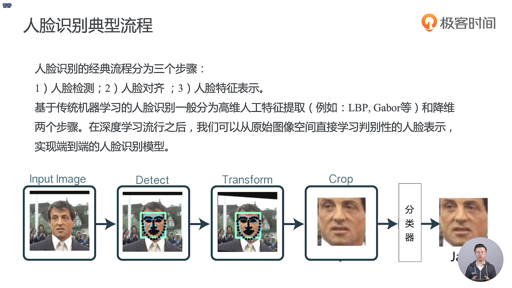
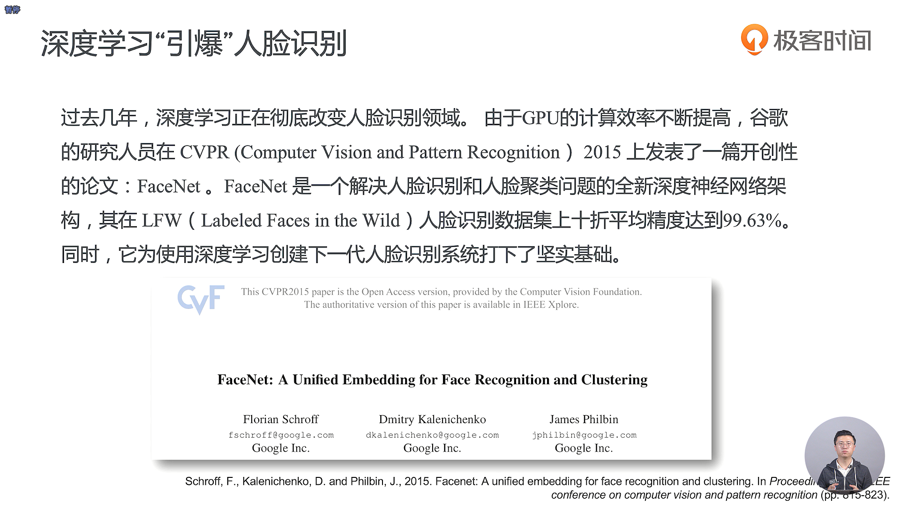
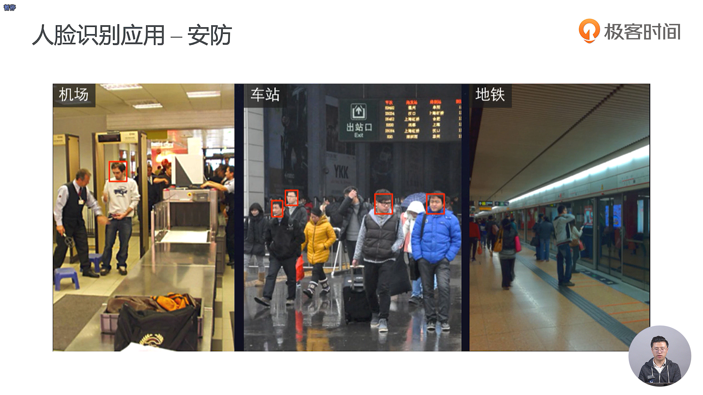
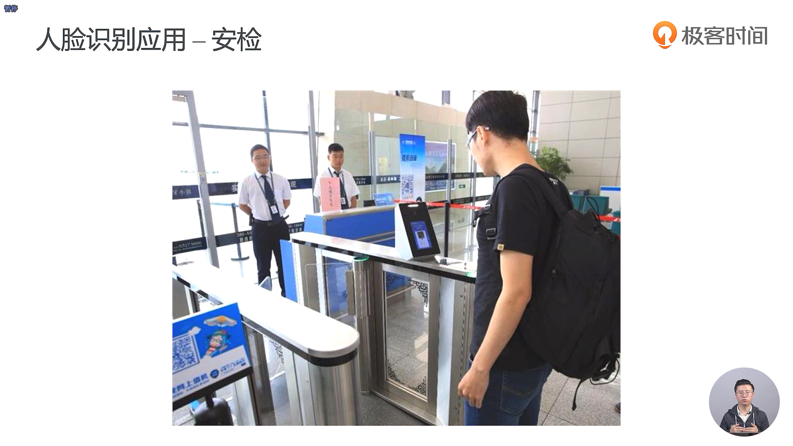
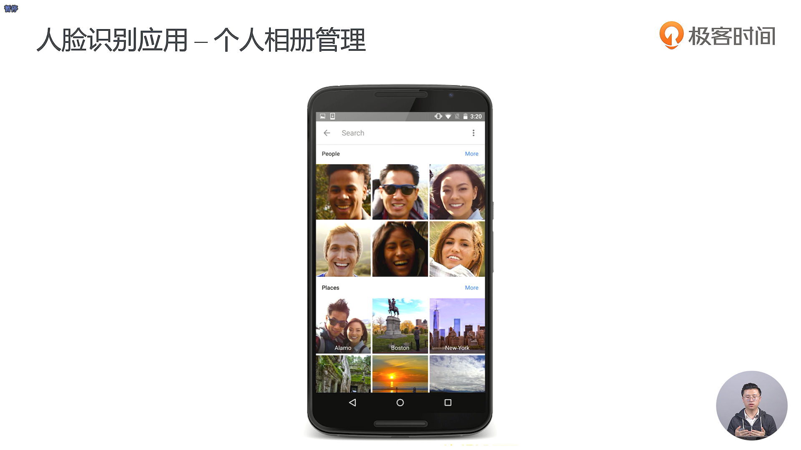
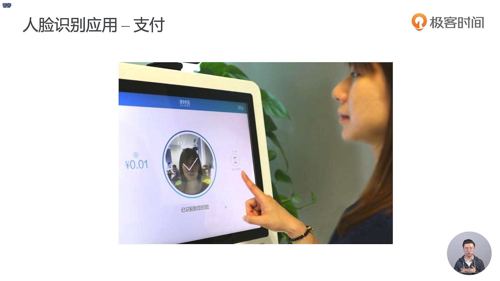
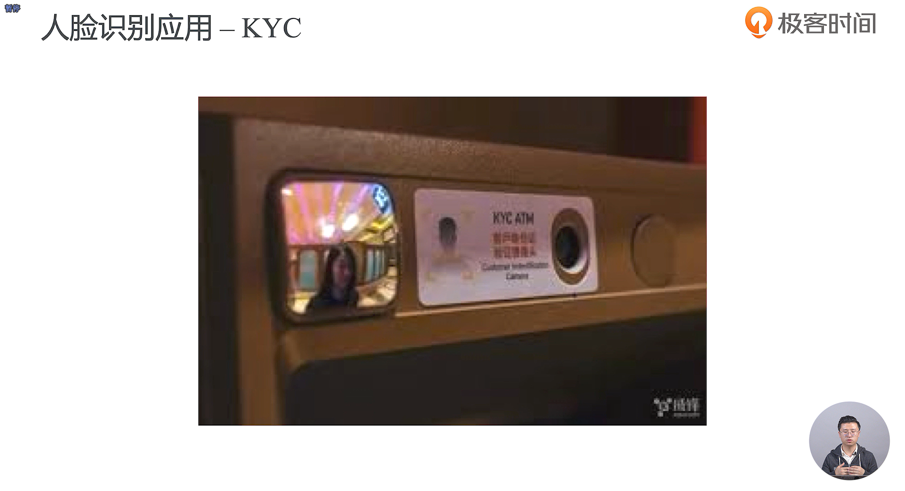
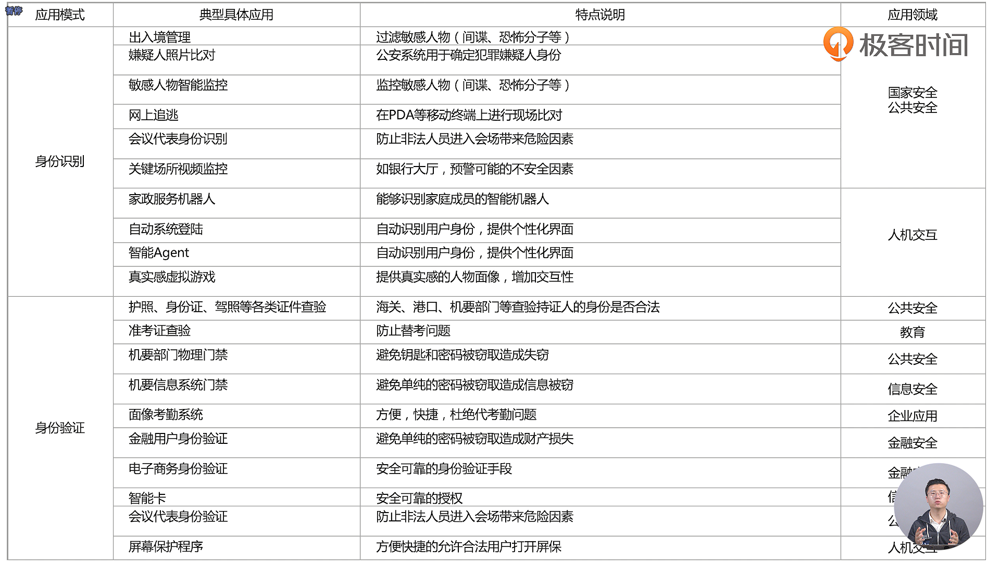

- 人脸对齐是我们人脸识别的流程中很重要的一个步骤
- 用卷积核去提取出一些高维度的特征
- 可以直接使用深度神经网络做一个端到端的训练，也就是说你交给神经网络的就是你这一张图片，不需要你手动地进行特征工程，因为神经网络会帮你进行这个特征工程，然后你最后的输出其实就是你的这一个分类的概率，或者说是否这两个是相似的
- 在人脸识别的最后，我们通常会去设计一个分类器，例如逻辑斯蒂回归或者是支持向量机或者是深度神经网络

 

- KYC的英文全称应该是 Know You Customer

