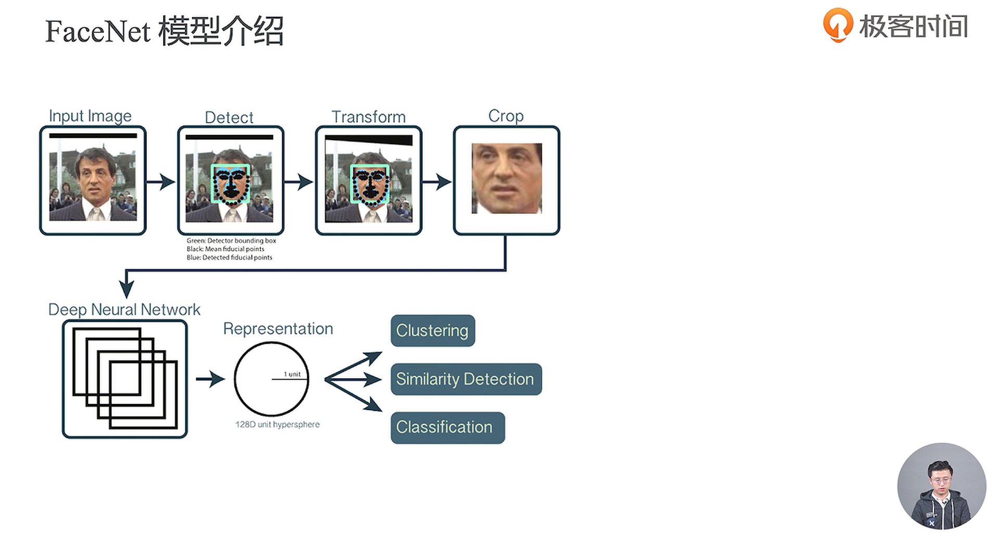

- FaceNet的关键点在于如果更好的去使用神经网络去学习到人脸的特征向量

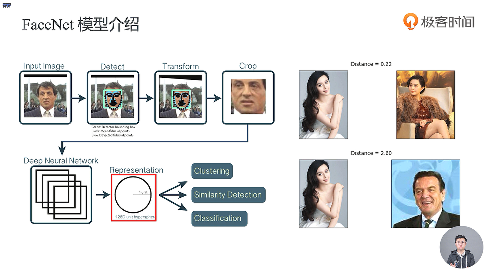

- 通过这个Distance是否大于这个阈值，我们就可以很好的去做分类

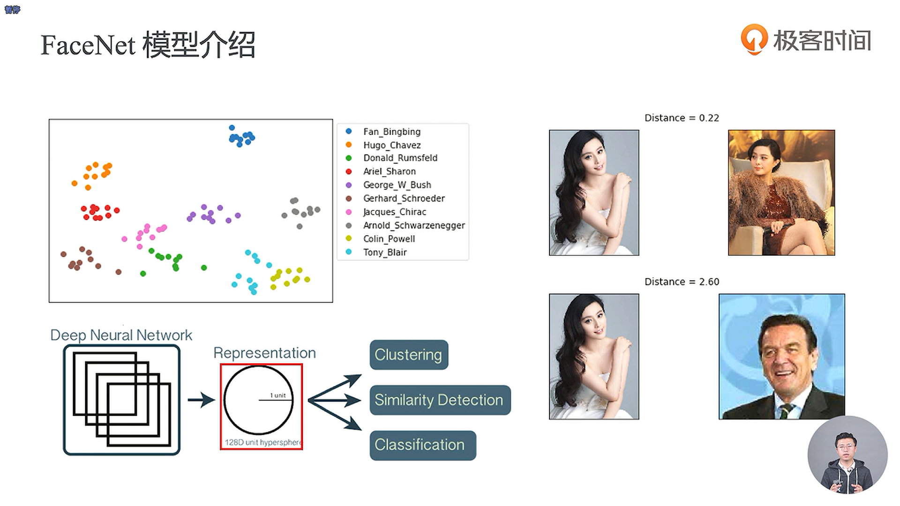

- Pre-Train是预训练，而Re-Train是再训练的意思
- sklearn中的tsne是一种降维方法

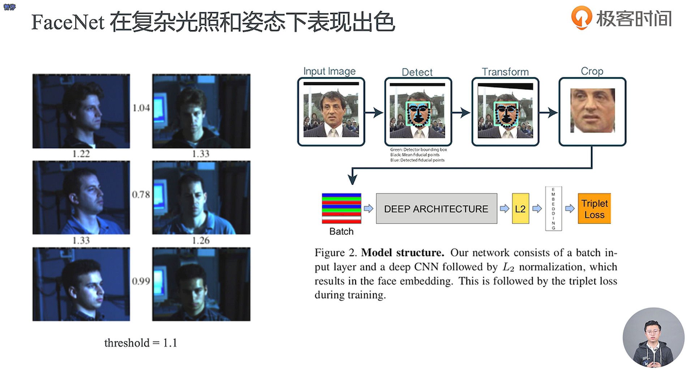

- Embedding就是把我们人脸的图像嵌入到了一个特征空间中

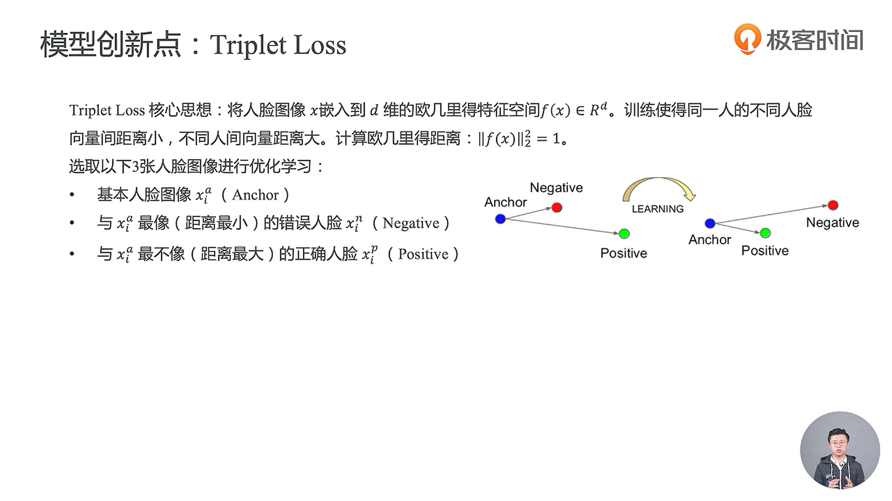

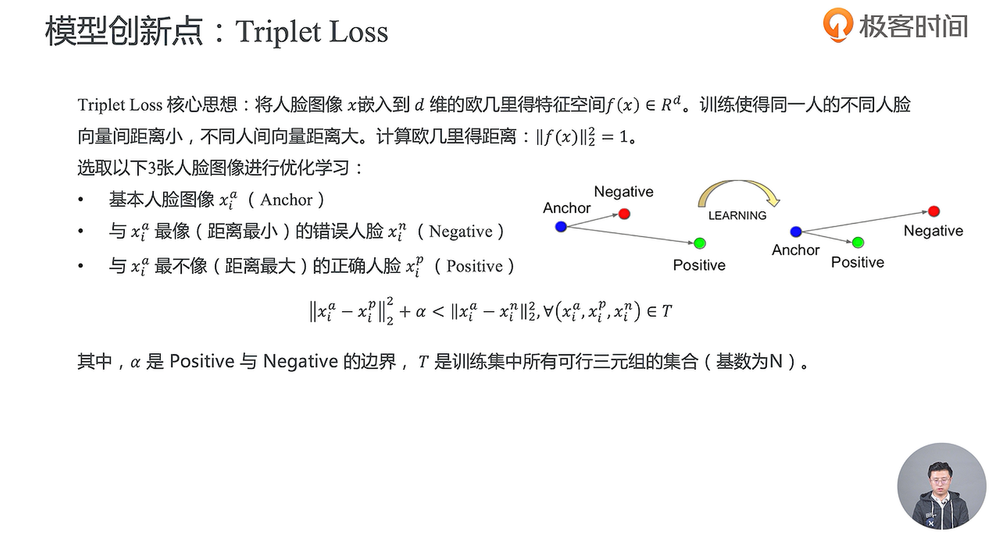

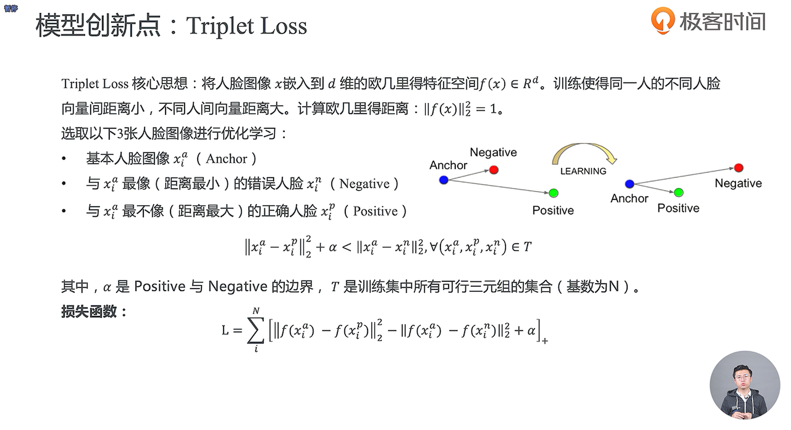

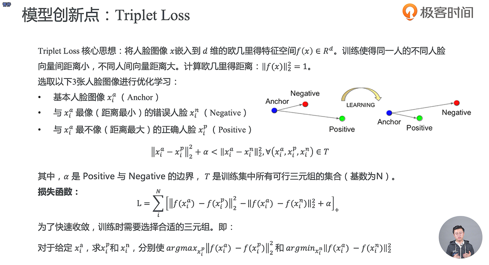

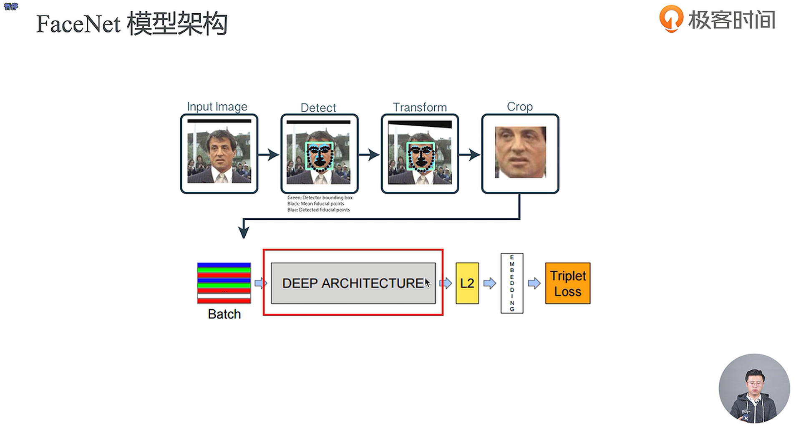

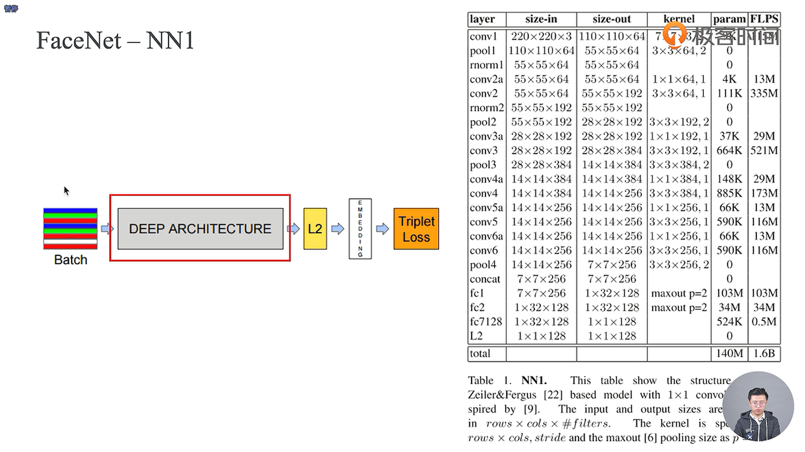

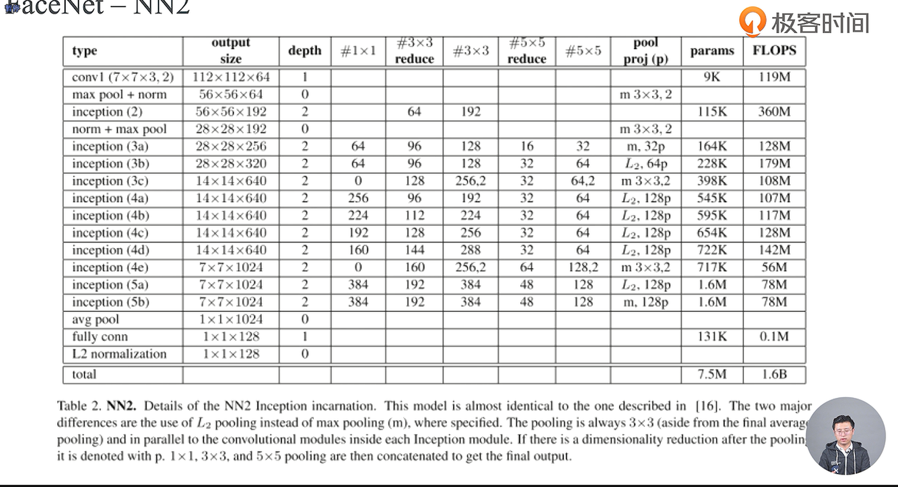

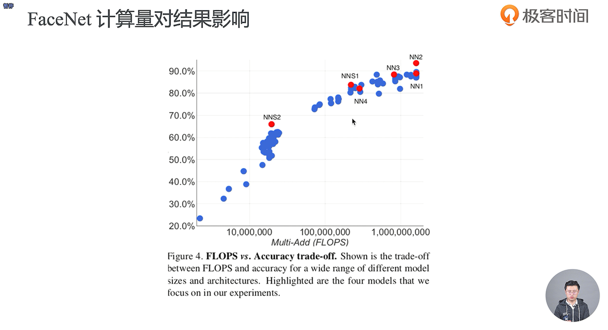

- 平衡计算量和准确率之间的一个抉择

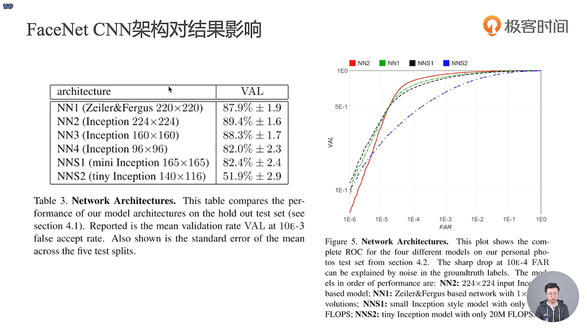

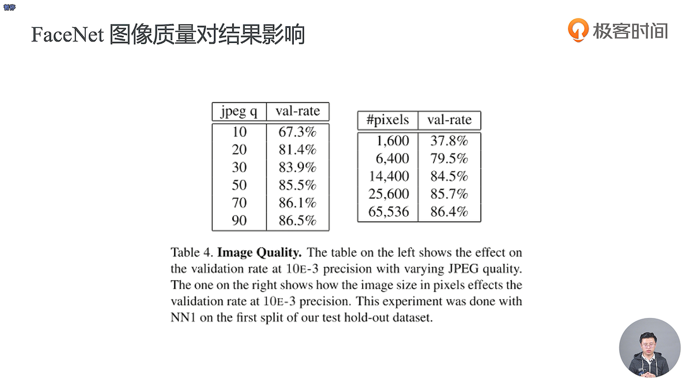

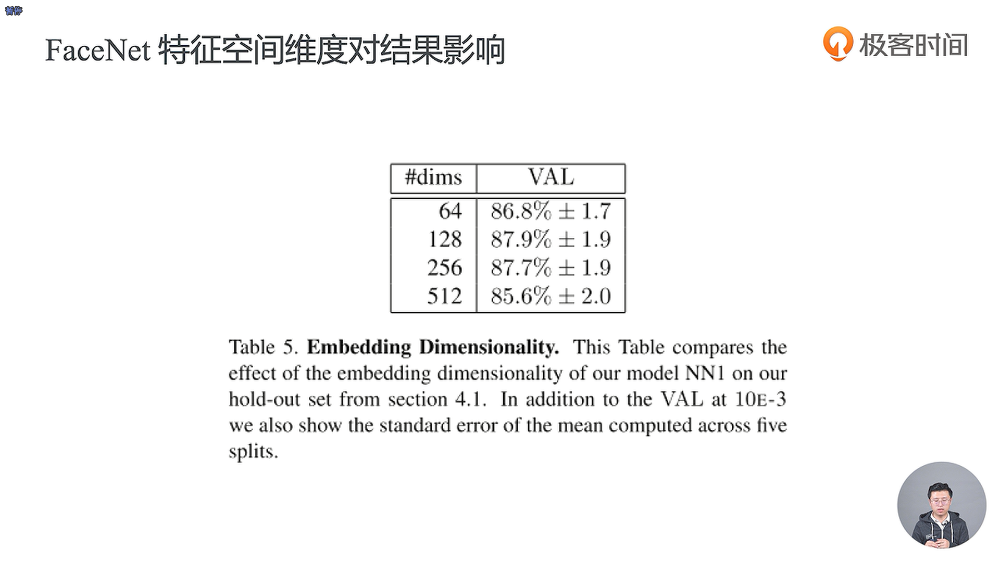

- 128维特征值是一个经验值

- 深度神经网络需要大量的数据去训练

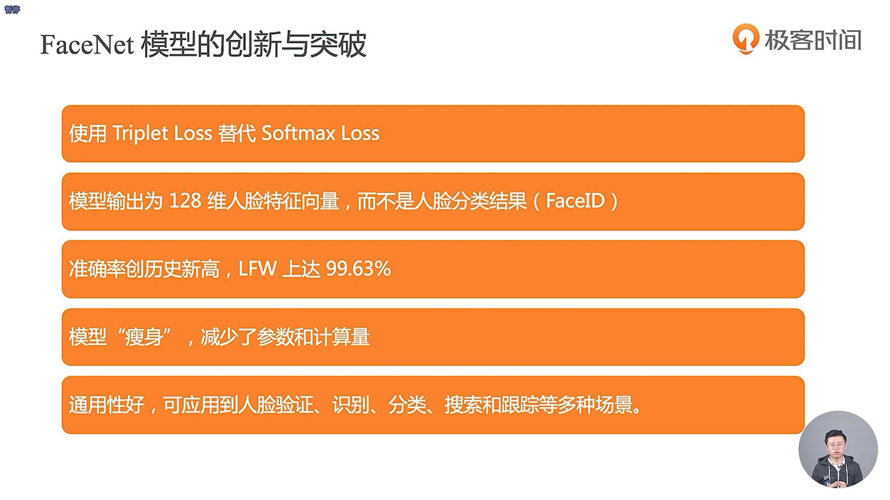

