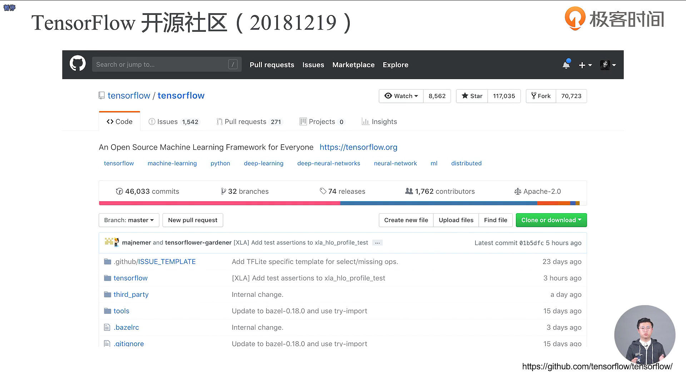
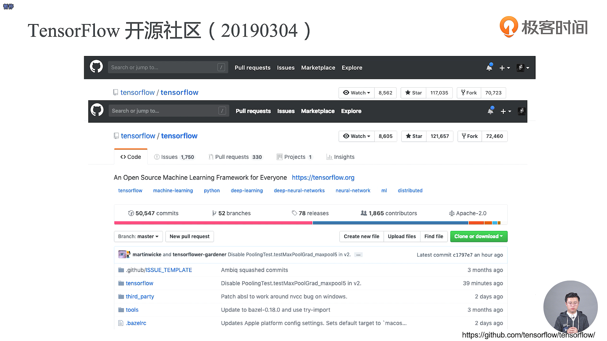
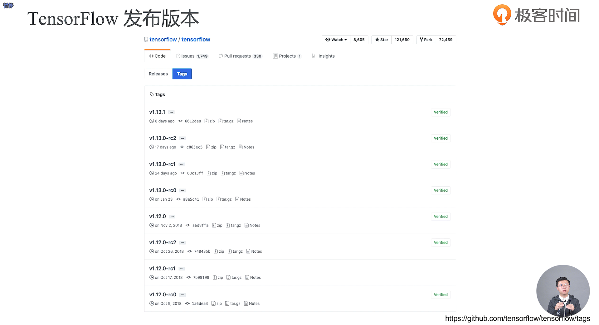
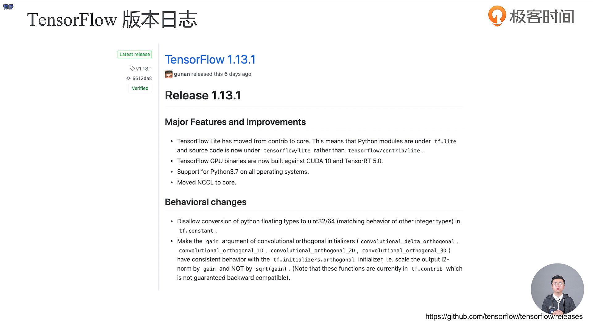
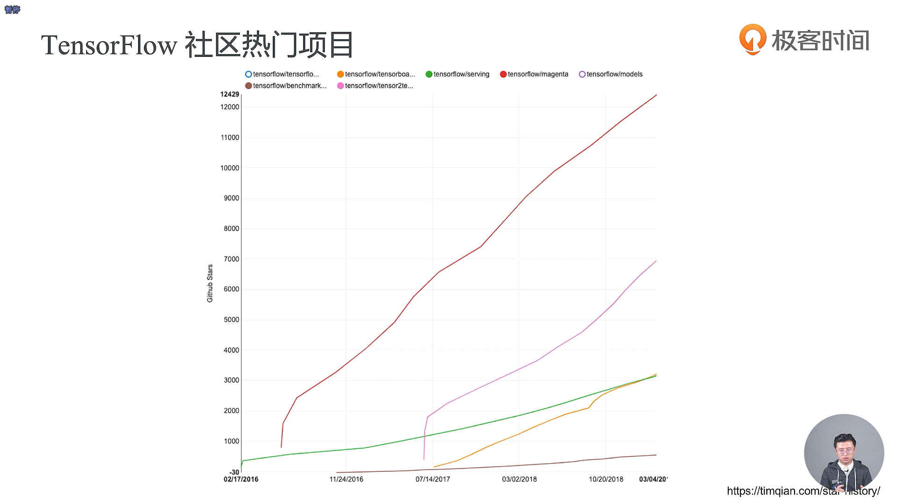
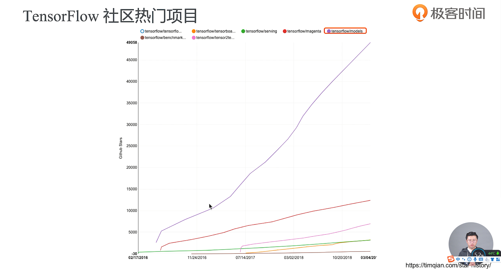

- Watch表示你在关注这个项目，那么这个项目一旦有任何的更新，都会出现在你的消息通知里，Star表示的是你喜欢这个项目，你给它点赞；Fork指的是你从当前的时间节点拷贝一份到你自己的仓库里面去；commits指的是你提交了多少次的代码，通常来说一个commit就是在解决一个特定的任务；branch是指的分支数；release指的是发布；contributor指的是社区贡献者

- Tag指的是我们的项目打了多少个标签，每一个标签其实就是对应着一个特定的版本

- Deprecation表示的是弃用的意思

